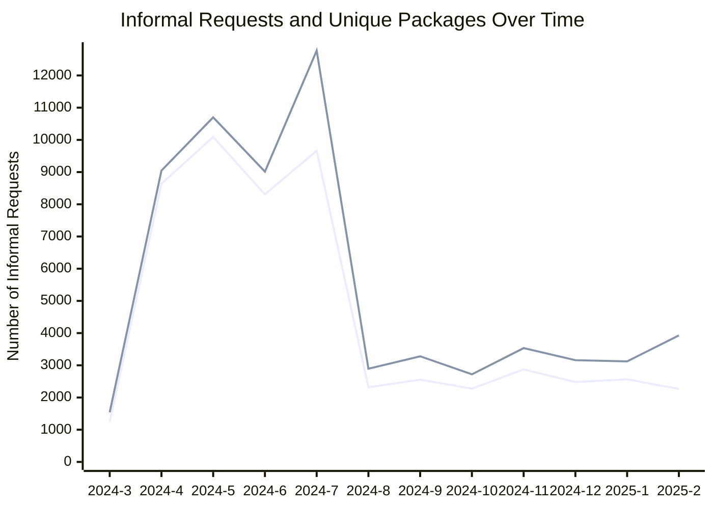

## Requests and Unique Package Requests last 12 months

## Number of Requests and Unique Package Requests last 24 Months

|   Year |   Month |   Number of Informal Requests |   Unique Packages |
|-------:|--------:|------------------------------:|------------------:|
|   2025 |       2 |                          3926 |              2268 |
|   2025 |       1 |                          3122 |              2564 |
|   2024 |      12 |                          3159 |              2481 |
|   2024 |      11 |                          3534 |              2873 |
|   2024 |      10 |                          2719 |              2275 |
|   2024 |       9 |                          3280 |              2554 |
|   2024 |       8 |                          2894 |              2317 |
|   2024 |       7 |                         12771 |              9663 |
|   2024 |       6 |                          9014 |              8309 |
|   2024 |       5 |                         10700 |             10090 |
|   2024 |       4 |                          9047 |              8636 |
|   2024 |       3 |                          1540 |              1242 |
|   2024 |       2 |                          2191 |              1794 |
|   2024 |       1 |                          2237 |              1717 |
|   2023 |      12 |                          1538 |              1123 |
|   2023 |      11 |                          1768 |              1418 |
|   2023 |      10 |                          1893 |              1581 |
|   2023 |       9 |                          1415 |              1160 |
|   2023 |       8 |                          1618 |              1288 |
|   2023 |       7 |                          1483 |              1181 |
|   2023 |       6 |                          1555 |              1227 |
|   2023 |       5 |                          1338 |              1159 |
|   2023 |       4 |                          1050 |               828 |
|   2023 |       3 |                          1021 |               822 |

## Organization Totals Table

| Organization Name - EN                              | Organization Name - FR                                  | owner_org   |   Number of Informal Requests |   Unique Packages |
|:----------------------------------------------------|:--------------------------------------------------------|:------------|------------------------------:|------------------:|
| Immigration, Refugees and Citizenship Canada        | Immigration, Réfugiés et Citoyenneté Canada             | cic         |                         23804 |              5998 |
| National Defence                                    | Défense nationale                                       | dnd-mdn     |                          5496 |              2674 |
| Royal Canadian Mounted Police                       | Gendarmerie royale du Canada                            | rcmp-grc    |                          5461 |              2020 |
| Global Affairs Canada                               | Affaires mondiales Canada                               | dfatd-maecd |                          5027 |              2500 |
| Health Canada                                       | Santé Canada                                            | hc-sc       |                          4701 |              3284 |
| Library and Archives Canada                         | Bibliothèque et Archives Canada                         | lac-bac     |                          3726 |              1778 |
| Canada Border Services Agency                       | Agence des services frontaliers du Canada               | cbsa-asfc   |                          3715 |               948 |
| Innovation, Science and Economic Development Canada | Innovation, Sciences et Développement économique Canada | ic          |                          3651 |              2104 |
| Privy Council Office                                | Bureau du Conseil privé                                 | pco-bcp     |                          3620 |              1641 |
| Canadian Security Intelligence Service              | Service canadien du renseignement de sécurité           | csis-scrs   |                          3391 |               584 |
| Canada Revenue Agency                               | Agence du revenu du Canada                              | cra-arc     |                          3285 |              1331 |
| Employment and Social Development Canada            | Emploi et Développement social Canada                   | esdc-edsc   |                          3031 |              1351 |
| Natural Resources Canada                            | Ressources naturelles Canada                            | nrcan-rncan |                          3004 |              1882 |
| Fisheries and Oceans Canada                         | Pêches et Océans Canada                                 | dfo-mpo     |                          2942 |              1397 |
| Public Safety Canada                                | Sécurité publique Canada                                | ps-sp       |                          2659 |              1081 |
| Department of Finance Canada                        | Ministère des Finances Canada                           | fin         |                          2570 |              1455 |
| Public Services and Procurement Canada              | Services publics et Approvisionnement Canada            | pwgsc-tpsgc |                          2549 |              1292 |
| Canadian Heritage                                   | Patrimoine canadien                                     | pch         |                          2504 |              1092 |
| Transport Canada                                    | Transports Canada                                       | tc          |                          2185 |              1383 |
| Correctional Service of Canada                      | Service correctionnel du Canada                         | csc-scc     |                          2056 |              1061 |
| Treasury Board of Canada Secretariat                | Secrétariat du Conseil du Trésor du Canada              | tbs-sct     |                          1841 |               778 |
| Public Health Agency of Canada                      | Agence de la santé publique du Canada                   | phac-aspc   |                          1636 |               775 |
| Department of Justice Canada                        | Ministère de la Justice Canada                          | jus         |                          1465 |               618 |
| Indigenous Services Canada                          | Services aux Autochtones Canada                         | isc-sac     |                          1429 |               621 |
| Environment and Climate Change Canada               | Environnement et Changement climatique Canada           | ec          |                          1368 |               549 |

