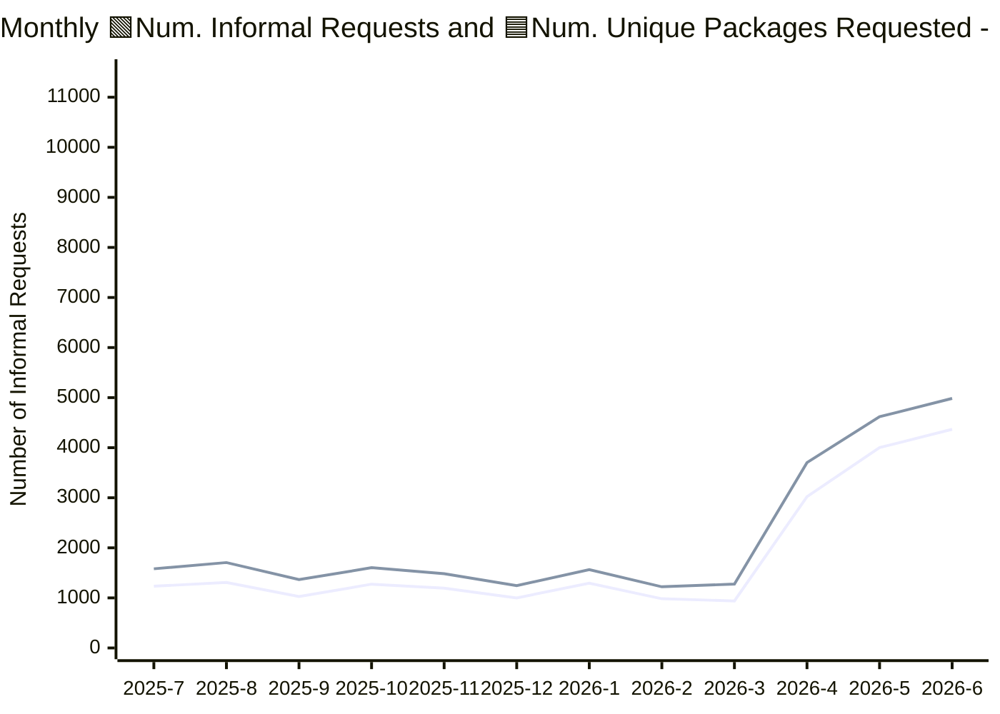

# ATI Informal Requests Report
 

[Open Government Analytics - ATI informal requests per summary](https://open.canada.ca/data/en/dataset/2916fad5-ebcc-4c86-b0f3-4f619b29f412/resource/e664cf3d-6cb7-4aaa-adfa-e459c2552e3e) is updated monthly providing stats on the volumne ATI Informal Requests submitted via `https://open.canada.ca/en/search/ati` 

This report offers a variety of aggregrations of the dataset 

| File | Flat Viewer |
|--|--|
|**idtot_df.csv**  *Top 100 ATI Packages by Number of Informal Requests for All Time.*  | |
|**org_df.csv** Number of Informal Requests by organization by month.||
|**orgtot.csv contains** Total Innformal Requests by organization.||
|**top_10_df.csv**  Top 10 packages by informal requsts by month.||

## Requests and Unique Package Requests last 12 months

```mermaid

xychart-beta
    title "Monthly 🟩Num. Informal Requests and 🟦Num. Unique Packages Requested - Last 12 Months"
    x-axis [2025-7, 2025-8, 2025-9, 2025-10, 2025-11, 2025-12, 2026-1, 2026-2, 2026-3, 2026-4, 2026-5, 2026-6]
    y-axis "Unique Packages" 0 --> 8955
    y-axis "Number of Informal Requests" 0 --> 11532

    line [1233, 1308, 1026, 1274, 1194, 999, 1295, 983, 939, 3021, 4001, 4367]
    line [1581, 1706, 1365, 1603, 1484, 1246, 1563, 1222, 1275, 3702, 4618, 4984]
```
## Number of Requests and Unique Package Requests last 24 Months

|   Year |   Month |   Number of Informal Requests |   Unique Packages |
|-------:|--------:|------------------------------:|------------------:|
|   2026 |       6 |                          4984 |              4367 |
|   2026 |       5 |                          4618 |              4001 |
|   2026 |       4 |                          3702 |              3021 |
|   2026 |       3 |                          1275 |               939 |
|   2026 |       2 |                          1222 |               983 |
|   2026 |       1 |                          1563 |              1295 |
|   2025 |      12 |                          1246 |               999 |
|   2025 |      11 |                          1484 |              1194 |
|   2025 |      10 |                          1603 |              1274 |
|   2025 |       9 |                          1365 |              1026 |
|   2025 |       8 |                          1706 |              1308 |
|   2025 |       7 |                          1581 |              1233 |
|   2025 |       6 |                          1432 |              1185 |
|   2025 |       5 |                          1619 |              1160 |
|   2025 |       4 |                          2070 |              1635 |
|   2025 |       3 |                          3030 |              2237 |
|   2025 |       2 |                          3752 |              2108 |
|   2025 |       1 |                          2996 |              2444 |
|   2024 |      12 |                          3043 |              2376 |
|   2024 |      11 |                          3449 |              2798 |
|   2024 |      10 |                          2578 |              2145 |
|   2024 |       9 |                          3201 |              2481 |
|   2024 |       8 |                          2752 |              2187 |
|   2024 |       7 |                         11522 |              8706 |

## Total Informal Requests Top 25 Organizations 

| Organization Name - EN                                 | Organization Name - FR                                    | owner_org                                            |   Number of Informal Requests |   Unique Packages |
|:-------------------------------------------------------|:----------------------------------------------------------|:-----------------------------------------------------|------------------------------:|------------------:|
| Immigration, Refugees and Citizenship Canada           | Immigration, Réfugiés et Citoyenneté Canada               | https://open.canada.ca/data/organization/cic         |                         31641 |              7234 |
| Royal Canadian Mounted Police                          | Gendarmerie royale du Canada                              | https://open.canada.ca/data/organization/rcmp-grc    |                          6946 |              2476 |
| Global Affairs Canada                                  | Affaires mondiales Canada                                 | https://open.canada.ca/data/organization/dfatd-maecd |                          6565 |              3214 |
| Health Canada                                          | Santé Canada                                              | https://open.canada.ca/data/organization/hc-sc       |                          6540 |              4581 |
| Innovation, Science and Economic Development Canada    | Innovation, Sciences et Développement économique Canada   | https://open.canada.ca/data/organization/ic          |                          5179 |              2790 |
| Privy Council Office                                   | Bureau du Conseil privé                                   | https://open.canada.ca/data/organization/pco-bcp     |                          4938 |              2187 |
| Canada Border Services Agency                          | Agence des services frontaliers du Canada                 | https://open.canada.ca/data/organization/cbsa-asfc   |                          4733 |              1272 |
| Library and Archives Canada                            | Bibliothèque et Archives Canada                           | https://open.canada.ca/data/organization/lac-bac     |                          4721 |              2582 |
| Employment and Social Development Canada               | Emploi et Développement social Canada                     | https://open.canada.ca/data/organization/esdc-edsc   |                          4082 |              1696 |
| Canadian Security Intelligence Service                 | Service canadien du renseignement de sécurité             | https://open.canada.ca/data/organization/csis-scrs   |                          4062 |               705 |
| Canada Revenue Agency                                  | Agence du revenu du Canada                                | https://open.canada.ca/data/organization/cra-arc     |                          3897 |              1550 |
| Natural Resources Canada                               | Ressources naturelles Canada                              | https://open.canada.ca/data/organization/nrcan-rncan |                          3728 |              2323 |
| Fisheries and Oceans Canada                            | Pêches et Océans Canada                                   | https://open.canada.ca/data/organization/dfo-mpo     |                          3592 |              1728 |
| Public Safety Canada                                   | Sécurité publique Canada                                  | https://open.canada.ca/data/organization/ps-sp       |                          3364 |              1378 |
| Department of Finance Canada                           | Ministère des Finances Canada                             | https://open.canada.ca/data/organization/fin         |                          3342 |              1844 |
| Public Services and Procurement Canada                 | Services publics et Approvisionnement Canada              | https://open.canada.ca/data/organization/pwgsc-tpsgc |                          3172 |              1569 |
| Canadian Heritage                                      | Patrimoine canadien                                       | https://open.canada.ca/data/organization/pch         |                          3088 |              1300 |
| National Defence                                       | Défense nationale                                         | https://open.canada.ca/data/organization/dnd-mdn     |                          2657 |              1527 |
| Correctional Service of Canada                         | Service correctionnel du Canada                           | https://open.canada.ca/data/organization/csc-scc     |                          2618 |              1293 |
| Public Health Agency of Canada                         | Agence de la santé publique du Canada                     | https://open.canada.ca/data/organization/phac-aspc   |                          2040 |               957 |
| Department of Justice Canada                           | Ministère de la Justice Canada                            | https://open.canada.ca/data/organization/jus         |                          2014 |               859 |
| Indigenous Services Canada                             | Services aux Autochtones Canada                           | https://open.canada.ca/data/organization/isc-sac     |                          1973 |               837 |
| Treasury Board of Canada Secretariat                   | Secrétariat du Conseil du Trésor du Canada                | https://open.canada.ca/data/organization/tbs-sct     |                          1911 |               809 |
| Environment and Climate Change Canada                  | Environnement et Changement climatique Canada             | https://open.canada.ca/data/organization/ec          |                          1664 |               640 |
| Crown-Indigenous Relations and Northern Affairs Canada | Relations Couronne-Autochtones et Affaires du Nord Canada | https://open.canada.ca/data/organization/aandc-aadnc |                          1412 |               489 |

## Top 25 Most Requested

| Unique Identifier                                                                                                   | Request Number   | owner_org                                                           | Organization Name - EN                       | Organization Name - FR                        |   Number of Informal Requests |
|:--------------------------------------------------------------------------------------------------------------------|:-----------------|:--------------------------------------------------------------------|:---------------------------------------------|:----------------------------------------------|------------------------------:|
| [3c1be26542a25dbff394488d5d1d5368](https://open.canada.ca/en/search/ati/reference/3c1be26542a25dbff394488d5d1d5368) | A-2024-014       | [aecl-eacl](https://open.canada.ca/data/organization/aecl-eacl)     | Atomic Energy of Canada Limited              | Énergie atomique du Canada, Limitée           |                          1000 |
| [16dbde4ba59e9c1d03865e6016854a53](https://open.canada.ca/en/search/ati/reference/16dbde4ba59e9c1d03865e6016854a53) | ATI2024-033      | [bdc](https://open.canada.ca/data/organization/bdc)                 | Business Development Bank of Canada          | Banque de développement du Canada             |                            86 |
| [9ceef5a77d1fadd06365de7665ee296c](https://open.canada.ca/en/search/ati/reference/9ceef5a77d1fadd06365de7665ee296c) | A-2023-00117     | [tbs-sct](https://open.canada.ca/data/organization/tbs-sct)         | Treasury Board of Canada Secretariat         | Secrétariat du Conseil du Trésor du Canada    |                            86 |
| [0840a2cb3bd6f7e62556b8584d4f1659](https://open.canada.ca/en/search/ati/reference/0840a2cb3bd6f7e62556b8584d4f1659) | 2025-01          | [mpa-apm](https://open.canada.ca/data/organization/mpa-apm)         | Montreal Port Authority                      | Administration portuaire de Montréal          |                            75 |
| [17d7ead4362f1ec0363d8e406c632653](https://open.canada.ca/en/search/ati/reference/17d7ead4362f1ec0363d8e406c632653) | 2025-03          | [mpa-apm](https://open.canada.ca/data/organization/mpa-apm)         | Montreal Port Authority                      | Administration portuaire de Montréal          |                            75 |
| [c82f2d40c7b2a3a2de0be5b8c8ad8996](https://open.canada.ca/en/search/ati/reference/c82f2d40c7b2a3a2de0be5b8c8ad8996) | 2024-06-12       | [prpa-appr](https://open.canada.ca/data/organization/prpa-appr)     | Prince Rupert Port Authority                 | L’Administration portuaire de Prince Rupert   |                            74 |
| [6be4ebb38887612c291d632ff4fa22f3](https://open.canada.ca/en/search/ati/reference/6be4ebb38887612c291d632ff4fa22f3) | 1A-2023-34690    | [cic](https://open.canada.ca/data/organization/cic)                 | Immigration, Refugees and Citizenship Canada | Immigration, Réfugiés et Citoyenneté Canada   |                            63 |
| [817d35b5021c2554ffe56317c32d82a0](https://open.canada.ca/en/search/ati/reference/817d35b5021c2554ffe56317c32d82a0) | A-2024-21239     | [cic](https://open.canada.ca/data/organization/cic)                 | Immigration, Refugees and Citizenship Canada | Immigration, Réfugiés et Citoyenneté Canada   |                            47 |
| [0112d4baa4ef1ad94931e00fdbb0887c](https://open.canada.ca/en/search/ati/reference/0112d4baa4ef1ad94931e00fdbb0887c) | A-2023-02215     | [esdc-edsc](https://open.canada.ca/data/organization/esdc-edsc)     | Employment and Social Development Canada     | Emploi et Développement social Canada         |                            45 |
| [c02441374acc93c0d335f9e1717cad3c](https://open.canada.ca/en/search/ati/reference/c02441374acc93c0d335f9e1717cad3c) | A-2019-83837     | [cic](https://open.canada.ca/data/organization/cic)                 | Immigration, Refugees and Citizenship Canada | Immigration, Réfugiés et Citoyenneté Canada   |                            44 |
| [6758d5bf059fbc8e16d92d0f1ff61e7c](https://open.canada.ca/en/search/ati/reference/6758d5bf059fbc8e16d92d0f1ff61e7c) | A-2022-52421     | [cic](https://open.canada.ca/data/organization/cic)                 | Immigration, Refugees and Citizenship Canada | Immigration, Réfugiés et Citoyenneté Canada   |                            43 |
| [43b79c2ade0139300fcd0b7fab0b55b0](https://open.canada.ca/en/search/ati/reference/43b79c2ade0139300fcd0b7fab0b55b0) | A-2024-00020     | [aafc-aac](https://open.canada.ca/data/organization/aafc-aac)       | Agriculture and Agri-Food Canada             | Agriculture et Agroalimentaire Canada         |                            43 |
| [489c43108a10bf94af2650dcaacd6b52](https://open.canada.ca/en/search/ati/reference/489c43108a10bf94af2650dcaacd6b52) | A-2023-00129     | [aafc-aac](https://open.canada.ca/data/organization/aafc-aac)       | Agriculture and Agri-Food Canada             | Agriculture et Agroalimentaire Canada         |                            42 |
| [02cf7be366f8c0b149a53cb936c4d8a5](https://open.canada.ca/en/search/ati/reference/02cf7be366f8c0b149a53cb936c4d8a5) | 1A-2022-08633    | [cic](https://open.canada.ca/data/organization/cic)                 | Immigration, Refugees and Citizenship Canada | Immigration, Réfugiés et Citoyenneté Canada   |                            41 |
| [6669303c723d67af9c252f2b47d086aa](https://open.canada.ca/en/search/ati/reference/6669303c723d67af9c252f2b47d086aa) | A-2020-00482     | [pwgsc-tpsgc](https://open.canada.ca/data/organization/pwgsc-tpsgc) | Public Services and Procurement Canada       | Services publics et Approvisionnement Canada  |                            40 |
| [fa4fa7f1c1c19d134f48403036626623](https://open.canada.ca/en/search/ati/reference/fa4fa7f1c1c19d134f48403036626623) | 2A-2021-12699    | [cic](https://open.canada.ca/data/organization/cic)                 | Immigration, Refugees and Citizenship Canada | Immigration, Réfugiés et Citoyenneté Canada   |                            40 |
| [f4571fd28501329a6055a7ea2a9ccc90](https://open.canada.ca/en/search/ati/reference/f4571fd28501329a6055a7ea2a9ccc90) | A-2023-00777     | [tbs-sct](https://open.canada.ca/data/organization/tbs-sct)         | Treasury Board of Canada Secretariat         | Secrétariat du Conseil du Trésor du Canada    |                            40 |
| [f94cf02dc4f1abc369c341e778482ed5](https://open.canada.ca/en/search/ati/reference/f94cf02dc4f1abc369c341e778482ed5) | 1A-2022-06919    | [cic](https://open.canada.ca/data/organization/cic)                 | Immigration, Refugees and Citizenship Canada | Immigration, Réfugiés et Citoyenneté Canada   |                            36 |
| [9674ed871ac388717efa733046a47ed1](https://open.canada.ca/en/search/ati/reference/9674ed871ac388717efa733046a47ed1) | 2A-2023-02896    | [cic](https://open.canada.ca/data/organization/cic)                 | Immigration, Refugees and Citizenship Canada | Immigration, Réfugiés et Citoyenneté Canada   |                            36 |
| [0f876de901a2ebf76c56471a67d05642](https://open.canada.ca/en/search/ati/reference/0f876de901a2ebf76c56471a67d05642) | A-2022-03600     | [cic](https://open.canada.ca/data/organization/cic)                 | Immigration, Refugees and Citizenship Canada | Immigration, Réfugiés et Citoyenneté Canada   |                            36 |
| [89090aeab44453c5d382e1af74fac873](https://open.canada.ca/en/search/ati/reference/89090aeab44453c5d382e1af74fac873) | A-2022-01590     | [cic](https://open.canada.ca/data/organization/cic)                 | Immigration, Refugees and Citizenship Canada | Immigration, Réfugiés et Citoyenneté Canada   |                            36 |
| [91cbf6a82443ac952cb5a57857a340b7](https://open.canada.ca/en/search/ati/reference/91cbf6a82443ac952cb5a57857a340b7) | A-2022-01147     | [ec](https://open.canada.ca/data/organization/ec)                   | Environment and Climate Change Canada        | Environnement et Changement climatique Canada |                            36 |
| [dc2df35abcdb427a9482e9c349287b5c](https://open.canada.ca/en/search/ati/reference/dc2df35abcdb427a9482e9c349287b5c) | 2A-2024-56507    | [cic](https://open.canada.ca/data/organization/cic)                 | Immigration, Refugees and Citizenship Canada | Immigration, Réfugiés et Citoyenneté Canada   |                            36 |
| [cca1c6a4dcf37611d33962b8a1e1fc43](https://open.canada.ca/en/search/ati/reference/cca1c6a4dcf37611d33962b8a1e1fc43) | A-2019-83845     | [cic](https://open.canada.ca/data/organization/cic)                 | Immigration, Refugees and Citizenship Canada | Immigration, Réfugiés et Citoyenneté Canada   |                            36 |
| [9ddddbe17f2825427ec77a010db22511](https://open.canada.ca/en/search/ati/reference/9ddddbe17f2825427ec77a010db22511) | A-2022-44116     | [cic](https://open.canada.ca/data/organization/cic)                 | Immigration, Refugees and Citizenship Canada | Immigration, Réfugiés et Citoyenneté Canada   |                            35 |

