# ATI Informal Requests Report
 

[Open Government Analytics - ATI informal requests per summary](https://open.canada.ca/data/en/dataset/2916fad5-ebcc-4c86-b0f3-4f619b29f412/resource/e664cf3d-6cb7-4aaa-adfa-e459c2552e3e) is updated monthly providing stats on the volumne ATI Informal Requests submitted via `https://open.canada.ca/en/search/ati` 

This report offers a variety of aggregrations of the dataset 

| File | Flat Viewer |
|--|--|
|**idtot_df.csv**  *Top 100 ATI Packages by Number of Informal Requests for All Time.*  | |
|**org_df.csv** Number of Informal Requests by organization by month.||
|**orgtot.csv contains** Total Innformal Requests by organization.||
|**top_10_df.csv**  Top 10 packages by informal requsts by month.||

## Requests and Unique Package Requests last 12 months

```mermaid

xychart-beta
    title "Monthly 🟩Num. Informal Requests and 🟦Num. Unique Packages Requested - Last 12 Months"
    x-axis [2025-1, 2025-2, 2025-3, 2025-4, 2025-5, 2025-6, 2025-7, 2025-8, 2025-9, 2025-10, 2025-11, 2025-12]
    y-axis "Unique Packages" 0 --> 10092
    y-axis "Number of Informal Requests" 0 --> 12776

    line [2551, 2259, 2289, 1710, 1201, 1240, 1283, 1321, 1051, 1320, 1223, 1039]
    line [3108, 3916, 3088, 2150, 1666, 1499, 1635, 1720, 1397, 1655, 1516, 1287]
```

## Number of Requests and Unique Package Requests last 24 Months

|   Year |   Month |   Number of Informal Requests |   Unique Packages |
|-------:|--------:|------------------------------:|------------------:|
|   2025 |      12 |                          1287 |              1039 |
|   2025 |      11 |                          1516 |              1223 |
|   2025 |      10 |                          1655 |              1320 |
|   2025 |       9 |                          1397 |              1051 |
|   2025 |       8 |                          1720 |              1321 |
|   2025 |       7 |                          1635 |              1283 |
|   2025 |       6 |                          1499 |              1240 |
|   2025 |       5 |                          1666 |              1201 |
|   2025 |       4 |                          2150 |              1710 |
|   2025 |       3 |                          3088 |              2289 |
|   2025 |       2 |                          3916 |              2259 |
|   2025 |       1 |                          3108 |              2551 |
|   2024 |      12 |                          3151 |              2479 |
|   2024 |      11 |                          3526 |              2866 |
|   2024 |      10 |                          2713 |              2271 |
|   2024 |       9 |                          3279 |              2553 |
|   2024 |       8 |                          2892 |              2315 |
|   2024 |       7 |                         12766 |              9659 |
|   2024 |       6 |                          9006 |              8301 |
|   2024 |       5 |                         10692 |             10082 |
|   2024 |       4 |                          9030 |              8620 |
|   2024 |       3 |                          1539 |              1241 |
|   2024 |       2 |                          2186 |              1789 |
|   2024 |       1 |                          2235 |              1715 |

## Total Informal Requests Top 25 Organizations 

| Organization Name - EN                              | Organization Name - FR                                  | owner_org                                            |   Number of Informal Requests |   Unique Packages |
|:----------------------------------------------------|:--------------------------------------------------------|:-----------------------------------------------------|------------------------------:|------------------:|
| Immigration, Refugees and Citizenship Canada        | Immigration, Réfugiés et Citoyenneté Canada             | https://open.canada.ca/data/organization/cic         |                         28880 |              6802 |
| National Defence                                    | Défense nationale                                       | https://open.canada.ca/data/organization/dnd-mdn     |                          6360 |              3053 |
| Royal Canadian Mounted Police                       | Gendarmerie royale du Canada                            | https://open.canada.ca/data/organization/rcmp-grc    |                          6259 |              2235 |
| Global Affairs Canada                               | Affaires mondiales Canada                               | https://open.canada.ca/data/organization/dfatd-maecd |                          5897 |              2887 |
| Health Canada                                       | Santé Canada                                            | https://open.canada.ca/data/organization/hc-sc       |                          5384 |              3714 |
| Privy Council Office                                | Bureau du Conseil privé                                 | https://open.canada.ca/data/organization/pco-bcp     |                          4277 |              1940 |
| Canada Border Services Agency                       | Agence des services frontaliers du Canada               | https://open.canada.ca/data/organization/cbsa-asfc   |                          4223 |              1112 |
| Innovation, Science and Economic Development Canada | Innovation, Sciences et Développement économique Canada | https://open.canada.ca/data/organization/ic          |                          4095 |              2300 |
| Library and Archives Canada                         | Bibliothèque et Archives Canada                         | https://open.canada.ca/data/organization/lac-bac     |                          3972 |              1935 |
| Canadian Security Intelligence Service              | Service canadien du renseignement de sécurité           | https://open.canada.ca/data/organization/csis-scrs   |                          3755 |               654 |
| Employment and Social Development Canada            | Emploi et Développement social Canada                   | https://open.canada.ca/data/organization/esdc-edsc   |                          3473 |              1498 |
| Canada Revenue Agency                               | Agence du revenu du Canada                              | https://open.canada.ca/data/organization/cra-arc     |                          3457 |              1360 |
| Natural Resources Canada                            | Ressources naturelles Canada                            | https://open.canada.ca/data/organization/nrcan-rncan |                          3354 |              2068 |
| Fisheries and Oceans Canada                         | Pêches et Océans Canada                                 | https://open.canada.ca/data/organization/dfo-mpo     |                          3212 |              1519 |
| Public Safety Canada                                | Sécurité publique Canada                                | https://open.canada.ca/data/organization/ps-sp       |                          3041 |              1218 |
| Department of Finance Canada                        | Ministère des Finances Canada                           | https://open.canada.ca/data/organization/fin         |                          2873 |              1588 |
| Public Services and Procurement Canada              | Services publics et Approvisionnement Canada            | https://open.canada.ca/data/organization/pwgsc-tpsgc |                          2827 |              1380 |
| Canadian Heritage                                   | Patrimoine canadien                                     | https://open.canada.ca/data/organization/pch         |                          2796 |              1168 |
| Transport Canada                                    | Transports Canada                                       | https://open.canada.ca/data/organization/tc          |                          2385 |              1452 |
| Correctional Service of Canada                      | Service correctionnel du Canada                         | https://open.canada.ca/data/organization/csc-scc     |                          2326 |              1146 |
| Treasury Board of Canada Secretariat                | Secrétariat du Conseil du Trésor du Canada              | https://open.canada.ca/data/organization/tbs-sct     |                          2038 |               864 |
| Public Health Agency of Canada                      | Agence de la santé publique du Canada                   | https://open.canada.ca/data/organization/phac-aspc   |                          1839 |               850 |
| Department of Justice Canada                        | Ministère de la Justice Canada                          | https://open.canada.ca/data/organization/jus         |                          1714 |               722 |
| Indigenous Services Canada                          | Services aux Autochtones Canada                         | https://open.canada.ca/data/organization/isc-sac     |                          1643 |               701 |
| Environment and Climate Change Canada               | Environnement et Changement climatique Canada           | https://open.canada.ca/data/organization/ec          |                          1541 |               595 |

## Top 25 Most Requested

| Unique Identifier                                                                                                   | Request Number   | owner_org                                                           | Organization Name - EN                       | Organization Name - FR                        |   Number of Informal Requests |
|:--------------------------------------------------------------------------------------------------------------------|:-----------------|:--------------------------------------------------------------------|:---------------------------------------------|:----------------------------------------------|------------------------------:|
| [3c1be26542a25dbff394488d5d1d5368](https://open.canada.ca/en/search/ati/reference/3c1be26542a25dbff394488d5d1d5368) | A-2024-014       | [aecl-eacl](https://open.canada.ca/data/organization/aecl-eacl)     | Atomic Energy of Canada Limited              | Énergie atomique du Canada, Limitée           |                          1000 |
| [9ceef5a77d1fadd06365de7665ee296c](https://open.canada.ca/en/search/ati/reference/9ceef5a77d1fadd06365de7665ee296c) | A-2023-00117     | [tbs-sct](https://open.canada.ca/data/organization/tbs-sct)         | Treasury Board of Canada Secretariat         | Secrétariat du Conseil du Trésor du Canada    |                            86 |
| [16dbde4ba59e9c1d03865e6016854a53](https://open.canada.ca/en/search/ati/reference/16dbde4ba59e9c1d03865e6016854a53) | ATI2024-033      | [bdc](https://open.canada.ca/data/organization/bdc)                 | Business Development Bank of Canada          | Banque de développement du Canada             |                            85 |
| [17d7ead4362f1ec0363d8e406c632653](https://open.canada.ca/en/search/ati/reference/17d7ead4362f1ec0363d8e406c632653) | 2025-03          | [mpa-apm](https://open.canada.ca/data/organization/mpa-apm)         | Montreal Port Authority                      | Administration portuaire de Montréal          |                            75 |
| [0840a2cb3bd6f7e62556b8584d4f1659](https://open.canada.ca/en/search/ati/reference/0840a2cb3bd6f7e62556b8584d4f1659) | 2025-01          | [mpa-apm](https://open.canada.ca/data/organization/mpa-apm)         | Montreal Port Authority                      | Administration portuaire de Montréal          |                            74 |
| [c82f2d40c7b2a3a2de0be5b8c8ad8996](https://open.canada.ca/en/search/ati/reference/c82f2d40c7b2a3a2de0be5b8c8ad8996) | 2024-06-12       | [prpa-appr](https://open.canada.ca/data/organization/prpa-appr)     | Prince Rupert Port Authority                 | L’Administration portuaire de Prince Rupert   |                            74 |
| [6be4ebb38887612c291d632ff4fa22f3](https://open.canada.ca/en/search/ati/reference/6be4ebb38887612c291d632ff4fa22f3) | 1A-2023-34690    | [cic](https://open.canada.ca/data/organization/cic)                 | Immigration, Refugees and Citizenship Canada | Immigration, Réfugiés et Citoyenneté Canada   |                            63 |
| [c02441374acc93c0d335f9e1717cad3c](https://open.canada.ca/en/search/ati/reference/c02441374acc93c0d335f9e1717cad3c) | A-2019-83837     | [cic](https://open.canada.ca/data/organization/cic)                 | Immigration, Refugees and Citizenship Canada | Immigration, Réfugiés et Citoyenneté Canada   |                            44 |
| [43b79c2ade0139300fcd0b7fab0b55b0](https://open.canada.ca/en/search/ati/reference/43b79c2ade0139300fcd0b7fab0b55b0) | A-2024-00020     | [aafc-aac](https://open.canada.ca/data/organization/aafc-aac)       | Agriculture and Agri-Food Canada             | Agriculture et Agroalimentaire Canada         |                            43 |
| [6758d5bf059fbc8e16d92d0f1ff61e7c](https://open.canada.ca/en/search/ati/reference/6758d5bf059fbc8e16d92d0f1ff61e7c) | A-2022-52421     | [cic](https://open.canada.ca/data/organization/cic)                 | Immigration, Refugees and Citizenship Canada | Immigration, Réfugiés et Citoyenneté Canada   |                            43 |
| [817d35b5021c2554ffe56317c32d82a0](https://open.canada.ca/en/search/ati/reference/817d35b5021c2554ffe56317c32d82a0) | A-2024-21239     | [cic](https://open.canada.ca/data/organization/cic)                 | Immigration, Refugees and Citizenship Canada | Immigration, Réfugiés et Citoyenneté Canada   |                            42 |
| [489c43108a10bf94af2650dcaacd6b52](https://open.canada.ca/en/search/ati/reference/489c43108a10bf94af2650dcaacd6b52) | A-2023-00129     | [aafc-aac](https://open.canada.ca/data/organization/aafc-aac)       | Agriculture and Agri-Food Canada             | Agriculture et Agroalimentaire Canada         |                            42 |
| [6669303c723d67af9c252f2b47d086aa](https://open.canada.ca/en/search/ati/reference/6669303c723d67af9c252f2b47d086aa) | A-2020-00482     | [pwgsc-tpsgc](https://open.canada.ca/data/organization/pwgsc-tpsgc) | Public Services and Procurement Canada       | Services publics et Approvisionnement Canada  |                            40 |
| [f4571fd28501329a6055a7ea2a9ccc90](https://open.canada.ca/en/search/ati/reference/f4571fd28501329a6055a7ea2a9ccc90) | A-2023-00777     | [tbs-sct](https://open.canada.ca/data/organization/tbs-sct)         | Treasury Board of Canada Secretariat         | Secrétariat du Conseil du Trésor du Canada    |                            40 |
| [fa4fa7f1c1c19d134f48403036626623](https://open.canada.ca/en/search/ati/reference/fa4fa7f1c1c19d134f48403036626623) | 2A-2021-12699    | [cic](https://open.canada.ca/data/organization/cic)                 | Immigration, Refugees and Citizenship Canada | Immigration, Réfugiés et Citoyenneté Canada   |                            39 |
| [02cf7be366f8c0b149a53cb936c4d8a5](https://open.canada.ca/en/search/ati/reference/02cf7be366f8c0b149a53cb936c4d8a5) | 1A-2022-08633    | [cic](https://open.canada.ca/data/organization/cic)                 | Immigration, Refugees and Citizenship Canada | Immigration, Réfugiés et Citoyenneté Canada   |                            37 |
| [0f876de901a2ebf76c56471a67d05642](https://open.canada.ca/en/search/ati/reference/0f876de901a2ebf76c56471a67d05642) | A-2022-03600     | [cic](https://open.canada.ca/data/organization/cic)                 | Immigration, Refugees and Citizenship Canada | Immigration, Réfugiés et Citoyenneté Canada   |                            36 |
| [cca1c6a4dcf37611d33962b8a1e1fc43](https://open.canada.ca/en/search/ati/reference/cca1c6a4dcf37611d33962b8a1e1fc43) | A-2019-83845     | [cic](https://open.canada.ca/data/organization/cic)                 | Immigration, Refugees and Citizenship Canada | Immigration, Réfugiés et Citoyenneté Canada   |                            36 |
| [f94cf02dc4f1abc369c341e778482ed5](https://open.canada.ca/en/search/ati/reference/f94cf02dc4f1abc369c341e778482ed5) | 1A-2022-06919    | [cic](https://open.canada.ca/data/organization/cic)                 | Immigration, Refugees and Citizenship Canada | Immigration, Réfugiés et Citoyenneté Canada   |                            36 |
| [9674ed871ac388717efa733046a47ed1](https://open.canada.ca/en/search/ati/reference/9674ed871ac388717efa733046a47ed1) | 2A-2023-02896    | [cic](https://open.canada.ca/data/organization/cic)                 | Immigration, Refugees and Citizenship Canada | Immigration, Réfugiés et Citoyenneté Canada   |                            36 |
| [b1d7780013585d893fbed095dac6ac11](https://open.canada.ca/en/search/ati/reference/b1d7780013585d893fbed095dac6ac11) | A-2020-144       | [csis-scrs](https://open.canada.ca/data/organization/csis-scrs)     | Canadian Security Intelligence Service       | Service canadien du renseignement de sécurité |                            35 |
| [91cbf6a82443ac952cb5a57857a340b7](https://open.canada.ca/en/search/ati/reference/91cbf6a82443ac952cb5a57857a340b7) | A-2022-01147     | [ec](https://open.canada.ca/data/organization/ec)                   | Environment and Climate Change Canada        | Environnement et Changement climatique Canada |                            35 |
| [89090aeab44453c5d382e1af74fac873](https://open.canada.ca/en/search/ati/reference/89090aeab44453c5d382e1af74fac873) | A-2022-01590     | [cic](https://open.canada.ca/data/organization/cic)                 | Immigration, Refugees and Citizenship Canada | Immigration, Réfugiés et Citoyenneté Canada   |                            35 |
| [dc2df35abcdb427a9482e9c349287b5c](https://open.canada.ca/en/search/ati/reference/dc2df35abcdb427a9482e9c349287b5c) | 2A-2024-56507    | [cic](https://open.canada.ca/data/organization/cic)                 | Immigration, Refugees and Citizenship Canada | Immigration, Réfugiés et Citoyenneté Canada   |                            35 |
| [9ddddbe17f2825427ec77a010db22511](https://open.canada.ca/en/search/ati/reference/9ddddbe17f2825427ec77a010db22511) | A-2022-44116     | [cic](https://open.canada.ca/data/organization/cic)                 | Immigration, Refugees and Citizenship Canada | Immigration, Réfugiés et Citoyenneté Canada   |                            34 |

