# ATI Informal Requests Report
 

[Open Government Analytics - ATI informal requests per summary](https://open.canada.ca/data/en/dataset/2916fad5-ebcc-4c86-b0f3-4f619b29f412/resource/e664cf3d-6cb7-4aaa-adfa-e459c2552e3e) is updated monthly providing stats on the volumne ATI Informal Requests submitted via `https://open.canada.ca/en/search/ati` 

This report offers a variety of aggregrations of the dataset 

| File | Flat Viewer |
|--|--|
|**idtot_df.csv**  *Top 100 ATI Packages by Number of Informal Requests for All Time.*  | |
|**org_df.csv** Number of Informal Requests by organization by month.||
|**orgtot.csv contains** Total Innformal Requests by organization.||
|**top_10_df.csv**  Top 10 packages by informal requsts by month.||

## Requests and Unique Package Requests last 12 months

```mermaid

xychart-beta
    title "Monthly 🟩Num. Informal Requests and 🟦Num. Unique Packages Requested - Last 12 Months"
    x-axis [2024-4, 2024-5, 2024-6, 2024-7, 2024-8, 2024-9, 2024-10, 2024-11, 2024-12, 2025-1, 2025-2, 2025-3]
    y-axis "Unique Packages" 0 --> 8904
    y-axis "Number of Informal Requests" 0 --> 11271

    line [7741, 8894, 7574, 8466, 2170, 2286, 2093, 2723, 2293, 2323, 2088, 2134]
    line [8134, 9438, 8231, 11261, 2665, 2900, 2513, 3346, 2941, 2807, 3720, 2920]
```

## Number of Requests and Unique Package Requests last 24 Months

|   Year |   Month |   Number of Informal Requests |   Unique Packages |
|-------:|--------:|------------------------------:|------------------:|
|   2025 |       3 |                          2920 |              2134 |
|   2025 |       2 |                          3720 |              2088 |
|   2025 |       1 |                          2807 |              2323 |
|   2024 |      12 |                          2941 |              2293 |
|   2024 |      11 |                          3346 |              2723 |
|   2024 |      10 |                          2513 |              2093 |
|   2024 |       9 |                          2900 |              2286 |
|   2024 |       8 |                          2665 |              2170 |
|   2024 |       7 |                         11261 |              8466 |
|   2024 |       6 |                          8231 |              7574 |
|   2024 |       5 |                          9438 |              8894 |
|   2024 |       4 |                          8134 |              7741 |
|   2024 |       3 |                          1367 |              1107 |
|   2024 |       2 |                          1982 |              1633 |
|   2024 |       1 |                          2098 |              1596 |
|   2023 |      12 |                          1445 |              1038 |
|   2023 |      11 |                          1635 |              1300 |
|   2023 |      10 |                          1740 |              1462 |
|   2023 |       9 |                          1271 |              1037 |
|   2023 |       8 |                          1498 |              1181 |
|   2023 |       7 |                          1349 |              1064 |
|   2023 |       6 |                          1401 |              1100 |
|   2023 |       5 |                          1281 |              1106 |
|   2023 |       4 |                           973 |               771 |

## Total Informal Requests Top 25 Organizations 

| Organization Name - EN                                 | Organization Name - FR                                    | owner_org                                            |   Number of Informal Requests |   Unique Packages |
|:-------------------------------------------------------|:----------------------------------------------------------|:-----------------------------------------------------|------------------------------:|------------------:|
| Immigration, Refugees and Citizenship Canada           | Immigration, Réfugiés et Citoyenneté Canada               | https://open.canada.ca/data/organization/cic         |                         24626 |              6117 |
| Royal Canadian Mounted Police                          | Gendarmerie royale du Canada                              | https://open.canada.ca/data/organization/rcmp-grc    |                          5550 |              2051 |
| National Defence                                       | Défense nationale                                         | https://open.canada.ca/data/organization/dnd-mdn     |                          5418 |              2718 |
| Global Affairs Canada                                  | Affaires mondiales Canada                                 | https://open.canada.ca/data/organization/dfatd-maecd |                          5192 |              2617 |
| Health Canada                                          | Santé Canada                                              | https://open.canada.ca/data/organization/hc-sc       |                          4962 |              3470 |
| Library and Archives Canada                            | Bibliothèque et Archives Canada                           | https://open.canada.ca/data/organization/lac-bac     |                          3861 |              1898 |
| Canada Border Services Agency                          | Agence des services frontaliers du Canada                 | https://open.canada.ca/data/organization/cbsa-asfc   |                          3776 |               974 |
| Innovation, Science and Economic Development Canada    | Innovation, Sciences et Développement économique Canada   | https://open.canada.ca/data/organization/ic          |                          3694 |              2105 |
| Canadian Security Intelligence Service                 | Service canadien du renseignement de sécurité             | https://open.canada.ca/data/organization/csis-scrs   |                          3445 |               584 |
| Canada Revenue Agency                                  | Agence du revenu du Canada                                | https://open.canada.ca/data/organization/cra-arc     |                          3351 |              1368 |
| Natural Resources Canada                               | Ressources naturelles Canada                              | https://open.canada.ca/data/organization/nrcan-rncan |                          3109 |              1973 |
| Employment and Social Development Canada               | Emploi et Développement social Canada                     | https://open.canada.ca/data/organization/esdc-edsc   |                          3052 |              1357 |
| Fisheries and Oceans Canada                            | Pêches et Océans Canada                                   | https://open.canada.ca/data/organization/dfo-mpo     |                          3014 |              1432 |
| Public Safety Canada                                   | Sécurité publique Canada                                  | https://open.canada.ca/data/organization/ps-sp       |                          2729 |              1111 |
| Department of Finance Canada                           | Ministère des Finances Canada                             | https://open.canada.ca/data/organization/fin         |                          2591 |              1456 |
| Canadian Heritage                                      | Patrimoine canadien                                       | https://open.canada.ca/data/organization/pch         |                          2540 |              1112 |
| Correctional Service of Canada                         | Service correctionnel du Canada                           | https://open.canada.ca/data/organization/csc-scc     |                          2081 |              1072 |
| Department of Justice Canada                           | Ministère de la Justice Canada                            | https://open.canada.ca/data/organization/jus         |                          1484 |               631 |
| Indigenous Services Canada                             | Services aux Autochtones Canada                           | https://open.canada.ca/data/organization/isc-sac     |                          1453 |               634 |
| Environment and Climate Change Canada                  | Environnement et Changement climatique Canada             | https://open.canada.ca/data/organization/ec          |                          1391 |               554 |
| Atomic Energy of Canada Limited                        | Énergie atomique du Canada, Limitée                       | https://open.canada.ca/data/organization/aecl-eacl   |                          1120 |                40 |
| Crown-Indigenous Relations and Northern Affairs Canada | Relations Couronne-Autochtones et Affaires du Nord Canada | https://open.canada.ca/data/organization/aandc-aadnc |                          1119 |               388 |
| Agriculture and Agri-Food Canada                       | Agriculture et Agroalimentaire Canada                     | https://open.canada.ca/data/organization/aafc-aac    |                          1087 |               374 |
| Canadian Food Inspection Agency                        | Agence canadienne d'inspection des aliments               | https://open.canada.ca/data/organization/cfia-acia   |                          1071 |               581 |
| Shared Services Canada                                 | Services partagés Canada                                  | https://open.canada.ca/data/organization/ssc-spc     |                          1048 |               538 |

## Top 25 Most Requested

| Unique Identifier                                                                                                   | Request Number   | owner_org                                                       | Organization Name - EN                       | Organization Name - FR                        |   Number of Informal Requests |
|:--------------------------------------------------------------------------------------------------------------------|:-----------------|:----------------------------------------------------------------|:---------------------------------------------|:----------------------------------------------|------------------------------:|
| [3c1be26542a25dbff394488d5d1d5368](https://open.canada.ca/en/search/ati/reference/3c1be26542a25dbff394488d5d1d5368) | A-2024-014       | [aecl-eacl](https://open.canada.ca/data/organization/aecl-eacl) | Atomic Energy of Canada Limited              | Énergie atomique du Canada, Limitée           |                           999 |
| [16dbde4ba59e9c1d03865e6016854a53](https://open.canada.ca/en/search/ati/reference/16dbde4ba59e9c1d03865e6016854a53) | ATI2024-033      | [bdc](https://open.canada.ca/data/organization/bdc)             | Business Development Bank of Canada          | Banque de développement du Canada             |                            85 |
| [6be4ebb38887612c291d632ff4fa22f3](https://open.canada.ca/en/search/ati/reference/6be4ebb38887612c291d632ff4fa22f3) | 1A-2023-34690    | [cic](https://open.canada.ca/data/organization/cic)             | Immigration, Refugees and Citizenship Canada | Immigration, Réfugiés et Citoyenneté Canada   |                            62 |
| [17d7ead4362f1ec0363d8e406c632653](https://open.canada.ca/en/search/ati/reference/17d7ead4362f1ec0363d8e406c632653) | 2025-03          | [mpa-apm](https://open.canada.ca/data/organization/mpa-apm)     | Montreal Port Authority                      | Administration portuaire de Montréal          |                            49 |
| [0840a2cb3bd6f7e62556b8584d4f1659](https://open.canada.ca/en/search/ati/reference/0840a2cb3bd6f7e62556b8584d4f1659) | 2025-01          | [mpa-apm](https://open.canada.ca/data/organization/mpa-apm)     | Montreal Port Authority                      | Administration portuaire de Montréal          |                            49 |
| [c82f2d40c7b2a3a2de0be5b8c8ad8996](https://open.canada.ca/en/search/ati/reference/c82f2d40c7b2a3a2de0be5b8c8ad8996) | 2024-06-12       | [prpa-appr](https://open.canada.ca/data/organization/prpa-appr) | Prince Rupert Port Authority                 | L’Administration portuaire de Prince Rupert   |                            48 |
| [489c43108a10bf94af2650dcaacd6b52](https://open.canada.ca/en/search/ati/reference/489c43108a10bf94af2650dcaacd6b52) | A-2023-00129     | [aafc-aac](https://open.canada.ca/data/organization/aafc-aac)   | Agriculture and Agri-Food Canada             | Agriculture et Agroalimentaire Canada         |                            42 |
| [43b79c2ade0139300fcd0b7fab0b55b0](https://open.canada.ca/en/search/ati/reference/43b79c2ade0139300fcd0b7fab0b55b0) | A-2024-00020     | [aafc-aac](https://open.canada.ca/data/organization/aafc-aac)   | Agriculture and Agri-Food Canada             | Agriculture et Agroalimentaire Canada         |                            42 |
| [c02441374acc93c0d335f9e1717cad3c](https://open.canada.ca/en/search/ati/reference/c02441374acc93c0d335f9e1717cad3c) | A-2019-83837     | [cic](https://open.canada.ca/data/organization/cic)             | Immigration, Refugees and Citizenship Canada | Immigration, Réfugiés et Citoyenneté Canada   |                            42 |
| [6758d5bf059fbc8e16d92d0f1ff61e7c](https://open.canada.ca/en/search/ati/reference/6758d5bf059fbc8e16d92d0f1ff61e7c) | A-2022-52421     | [cic](https://open.canada.ca/data/organization/cic)             | Immigration, Refugees and Citizenship Canada | Immigration, Réfugiés et Citoyenneté Canada   |                            42 |
| [02cf7be366f8c0b149a53cb936c4d8a5](https://open.canada.ca/en/search/ati/reference/02cf7be366f8c0b149a53cb936c4d8a5) | 1A-2022-08633    | [cic](https://open.canada.ca/data/organization/cic)             | Immigration, Refugees and Citizenship Canada | Immigration, Réfugiés et Citoyenneté Canada   |                            37 |
| [f94cf02dc4f1abc369c341e778482ed5](https://open.canada.ca/en/search/ati/reference/f94cf02dc4f1abc369c341e778482ed5) | 1A-2022-06919    | [cic](https://open.canada.ca/data/organization/cic)             | Immigration, Refugees and Citizenship Canada | Immigration, Réfugiés et Citoyenneté Canada   |                            36 |
| [0f876de901a2ebf76c56471a67d05642](https://open.canada.ca/en/search/ati/reference/0f876de901a2ebf76c56471a67d05642) | A-2022-03600     | [cic](https://open.canada.ca/data/organization/cic)             | Immigration, Refugees and Citizenship Canada | Immigration, Réfugiés et Citoyenneté Canada   |                            36 |
| [9674ed871ac388717efa733046a47ed1](https://open.canada.ca/en/search/ati/reference/9674ed871ac388717efa733046a47ed1) | 2A-2023-02896    | [cic](https://open.canada.ca/data/organization/cic)             | Immigration, Refugees and Citizenship Canada | Immigration, Réfugiés et Citoyenneté Canada   |                            36 |
| [cca1c6a4dcf37611d33962b8a1e1fc43](https://open.canada.ca/en/search/ati/reference/cca1c6a4dcf37611d33962b8a1e1fc43) | A-2019-83845     | [cic](https://open.canada.ca/data/organization/cic)             | Immigration, Refugees and Citizenship Canada | Immigration, Réfugiés et Citoyenneté Canada   |                            35 |
| [89090aeab44453c5d382e1af74fac873](https://open.canada.ca/en/search/ati/reference/89090aeab44453c5d382e1af74fac873) | A-2022-01590     | [cic](https://open.canada.ca/data/organization/cic)             | Immigration, Refugees and Citizenship Canada | Immigration, Réfugiés et Citoyenneté Canada   |                            34 |
| [9ddddbe17f2825427ec77a010db22511](https://open.canada.ca/en/search/ati/reference/9ddddbe17f2825427ec77a010db22511) | A-2022-44116     | [cic](https://open.canada.ca/data/organization/cic)             | Immigration, Refugees and Citizenship Canada | Immigration, Réfugiés et Citoyenneté Canada   |                            34 |
| [fa4fa7f1c1c19d134f48403036626623](https://open.canada.ca/en/search/ati/reference/fa4fa7f1c1c19d134f48403036626623) | 2A-2021-12699    | [cic](https://open.canada.ca/data/organization/cic)             | Immigration, Refugees and Citizenship Canada | Immigration, Réfugiés et Citoyenneté Canada   |                            34 |
| [b1d7780013585d893fbed095dac6ac11](https://open.canada.ca/en/search/ati/reference/b1d7780013585d893fbed095dac6ac11) | A-2020-144       | [csis-scrs](https://open.canada.ca/data/organization/csis-scrs) | Canadian Security Intelligence Service       | Service canadien du renseignement de sécurité |                            33 |
| [efc8e31eceb9b168153d6aad073740e2](https://open.canada.ca/en/search/ati/reference/efc8e31eceb9b168153d6aad073740e2) | 2A-2021-61194    | [cic](https://open.canada.ca/data/organization/cic)             | Immigration, Refugees and Citizenship Canada | Immigration, Réfugiés et Citoyenneté Canada   |                            33 |
| [3d7f1c22acde8320b5b8dea9ebe8fdff](https://open.canada.ca/en/search/ati/reference/3d7f1c22acde8320b5b8dea9ebe8fdff) | 1A-2023-07235    | [cic](https://open.canada.ca/data/organization/cic)             | Immigration, Refugees and Citizenship Canada | Immigration, Réfugiés et Citoyenneté Canada   |                            32 |
| [034678e46266d05c918e794d7f39d5be](https://open.canada.ca/en/search/ati/reference/034678e46266d05c918e794d7f39d5be) | 2A-2020-93526    | [cic](https://open.canada.ca/data/organization/cic)             | Immigration, Refugees and Citizenship Canada | Immigration, Réfugiés et Citoyenneté Canada   |                            31 |
| [88c5c9d37af76de85fbb3383135d7c51](https://open.canada.ca/en/search/ati/reference/88c5c9d37af76de85fbb3383135d7c51) | A-2021-02254     | [esdc-edsc](https://open.canada.ca/data/organization/esdc-edsc) | Employment and Social Development Canada     | Emploi et Développement social Canada         |                            30 |
| [d793308d8e71096775e185f1f738515f](https://open.canada.ca/en/search/ati/reference/d793308d8e71096775e185f1f738515f) | A-2021-669       | [csis-scrs](https://open.canada.ca/data/organization/csis-scrs) | Canadian Security Intelligence Service       | Service canadien du renseignement de sécurité |                            30 |
| [489b57895397d43833ecdb0f8b88b2cf](https://open.canada.ca/en/search/ati/reference/489b57895397d43833ecdb0f8b88b2cf) | A-2020-373       | [csis-scrs](https://open.canada.ca/data/organization/csis-scrs) | Canadian Security Intelligence Service       | Service canadien du renseignement de sécurité |                            29 |

