# ATI Informal Requests Report
 

[Open Government Analytics - ATI informal requests per summary](https://open.canada.ca/data/en/dataset/2916fad5-ebcc-4c86-b0f3-4f619b29f412/resource/e664cf3d-6cb7-4aaa-adfa-e459c2552e3e) is updated monthly providing stats on the volumne ATI Informal Requests submitted via `https://open.canada.ca/en/search/ati` 

This report offers a variety of aggregrations of the dataset 

| File | Flat Viewer |
|--|--|
|**idtot_df.csv**  *Top 100 ATI Packages by Number of Informal Requests for All Time.*  | |
|**org_df.csv** Number of Informal Requests by organization by month.||
|**orgtot.csv contains** Total Innformal Requests by organization.||
|**top_10_df.csv**  Top 10 packages by informal requsts by month.||

## Requests and Unique Package Requests last 12 months

```mermaid

xychart-beta
    title "Monthly 🟩Num. Informal Requests and 🟦Num. Unique Packages Requested - Last 12 Months"
    x-axis [2024-9, 2024-10, 2024-11, 2024-12, 2025-1, 2025-2, 2025-3, 2025-4, 2025-5, 2025-6, 2025-7, 2025-8]
    y-axis "Unique Packages" 0 --> 8990
    y-axis "Number of Informal Requests" 0 --> 10413

    line [1849, 1893, 2347, 1874, 1919, 1662, 1751, 1467, 744, 882, 941, 930]
    line [2138, 2236, 2688, 2223, 2237, 3027, 2080, 1808, 849, 982, 1109, 1070]
```

## Number of Requests and Unique Package Requests last 24 Months

|   Year |   Month |   Number of Informal Requests |   Unique Packages |
|-------:|--------:|------------------------------:|------------------:|
|   2025 |       8 |                          1070 |               930 |
|   2025 |       7 |                          1109 |               941 |
|   2025 |       6 |                           982 |               882 |
|   2025 |       5 |                           849 |               744 |
|   2025 |       4 |                          1808 |              1467 |
|   2025 |       3 |                          2080 |              1751 |
|   2025 |       2 |                          3027 |              1662 |
|   2025 |       1 |                          2237 |              1919 |
|   2024 |      12 |                          2223 |              1874 |
|   2024 |      11 |                          2688 |              2347 |
|   2024 |      10 |                          2236 |              1893 |
|   2024 |       9 |                          2138 |              1849 |
|   2024 |       8 |                          2149 |              1781 |
|   2024 |       7 |                         10403 |              8001 |
|   2024 |       6 |                          7655 |              7141 |
|   2024 |       5 |                          9339 |              8980 |
|   2024 |       4 |                          7178 |              6953 |
|   2024 |       3 |                           971 |               849 |
|   2024 |       2 |                          1611 |              1355 |
|   2024 |       1 |                          1586 |              1308 |
|   2023 |      12 |                           949 |               807 |
|   2023 |      11 |                          1312 |              1078 |
|   2023 |      10 |                          1465 |              1284 |
|   2023 |       9 |                          1052 |               880 |

## Total Informal Requests Top 25 Organizations 

| Organization Name - EN                                 | Organization Name - FR                                    | owner_org                                            |   Number of Informal Requests |   Unique Packages |
|:-------------------------------------------------------|:----------------------------------------------------------|:-----------------------------------------------------|------------------------------:|------------------:|
| Immigration, Refugees and Citizenship Canada           | Immigration, Réfugiés et Citoyenneté Canada               | https://open.canada.ca/data/organization/cic         |                         12910 |              3342 |
| National Defence                                       | Défense nationale                                         | https://open.canada.ca/data/organization/dnd-mdn     |                          6075 |              2938 |
| Royal Canadian Mounted Police                          | Gendarmerie royale du Canada                              | https://open.canada.ca/data/organization/rcmp-grc    |                          6021 |              2168 |
| Global Affairs Canada                                  | Affaires mondiales Canada                                 | https://open.canada.ca/data/organization/dfatd-maecd |                          5604 |              2773 |
| Health Canada                                          | Santé Canada                                              | https://open.canada.ca/data/organization/hc-sc       |                          5236 |              3657 |
| Canada Border Services Agency                          | Agence des services frontaliers du Canada                 | https://open.canada.ca/data/organization/cbsa-asfc   |                          4007 |              1040 |
| Library and Archives Canada                            | Bibliothèque et Archives Canada                           | https://open.canada.ca/data/organization/lac-bac     |                          3935 |              1911 |
| Innovation, Science and Economic Development Canada    | Innovation, Sciences et Développement économique Canada   | https://open.canada.ca/data/organization/ic          |                          3919 |              2209 |
| Canadian Security Intelligence Service                 | Service canadien du renseignement de sécurité             | https://open.canada.ca/data/organization/csis-scrs   |                          3625 |               612 |
| Canada Revenue Agency                                  | Agence du revenu du Canada                                | https://open.canada.ca/data/organization/cra-arc     |                          3350 |              1334 |
| Employment and Social Development Canada               | Emploi et Développement social Canada                     | https://open.canada.ca/data/organization/esdc-edsc   |                          3281 |              1446 |
| Natural Resources Canada                               | Ressources naturelles Canada                              | https://open.canada.ca/data/organization/nrcan-rncan |                          3279 |              2033 |
| Fisheries and Oceans Canada                            | Pêches et Océans Canada                                   | https://open.canada.ca/data/organization/dfo-mpo     |                          3158 |              1493 |
| Public Safety Canada                                   | Sécurité publique Canada                                  | https://open.canada.ca/data/organization/ps-sp       |                          2941 |              1191 |
| Department of Finance Canada                           | Ministère des Finances Canada                             | https://open.canada.ca/data/organization/fin         |                          2748 |              1525 |
| Canadian Heritage                                      | Patrimoine canadien                                       | https://open.canada.ca/data/organization/pch         |                          2677 |              1137 |
| Public Services and Procurement Canada                 | Services publics et Approvisionnement Canada              | https://open.canada.ca/data/organization/pwgsc-tpsgc |                          2329 |              1155 |
| Correctional Service of Canada                         | Service correctionnel du Canada                           | https://open.canada.ca/data/organization/csc-scc     |                          2287 |              1132 |
| Public Health Agency of Canada                         | Agence de la santé publique du Canada                     | https://open.canada.ca/data/organization/phac-aspc   |                          1782 |               825 |
| Department of Justice Canada                           | Ministère de la Justice Canada                            | https://open.canada.ca/data/organization/jus         |                          1622 |               680 |
| Indigenous Services Canada                             | Services aux Autochtones Canada                           | https://open.canada.ca/data/organization/isc-sac     |                          1562 |               675 |
| Environment and Climate Change Canada                  | Environnement et Changement climatique Canada             | https://open.canada.ca/data/organization/ec          |                          1483 |               573 |
| Crown-Indigenous Relations and Northern Affairs Canada | Relations Couronne-Autochtones et Affaires du Nord Canada | https://open.canada.ca/data/organization/aandc-aadnc |                          1231 |               410 |
| Atomic Energy of Canada Limited                        | Énergie atomique du Canada, Limitée                       | https://open.canada.ca/data/organization/aecl-eacl   |                          1129 |                44 |
| Agriculture and Agri-Food Canada                       | Agriculture et Agroalimentaire Canada                     | https://open.canada.ca/data/organization/aafc-aac    |                          1123 |               387 |

## Top 25 Most Requested

| Unique Identifier                                                                                                   | Request Number   | owner_org                                                           | Organization Name - EN                       | Organization Name - FR                        |   Number of Informal Requests |
|:--------------------------------------------------------------------------------------------------------------------|:-----------------|:--------------------------------------------------------------------|:---------------------------------------------|:----------------------------------------------|------------------------------:|
| [3c1be26542a25dbff394488d5d1d5368](https://open.canada.ca/en/search/ati/reference/3c1be26542a25dbff394488d5d1d5368) | A-2024-014       | [aecl-eacl](https://open.canada.ca/data/organization/aecl-eacl)     | Atomic Energy of Canada Limited              | Énergie atomique du Canada, Limitée           |                          1000 |
| [16dbde4ba59e9c1d03865e6016854a53](https://open.canada.ca/en/search/ati/reference/16dbde4ba59e9c1d03865e6016854a53) | ATI2024-033      | [bdc](https://open.canada.ca/data/organization/bdc)                 | Business Development Bank of Canada          | Banque de développement du Canada             |                            85 |
| [17d7ead4362f1ec0363d8e406c632653](https://open.canada.ca/en/search/ati/reference/17d7ead4362f1ec0363d8e406c632653) | 2025-03          | [mpa-apm](https://open.canada.ca/data/organization/mpa-apm)         | Montreal Port Authority                      | Administration portuaire de Montréal          |                            75 |
| [0840a2cb3bd6f7e62556b8584d4f1659](https://open.canada.ca/en/search/ati/reference/0840a2cb3bd6f7e62556b8584d4f1659) | 2025-01          | [mpa-apm](https://open.canada.ca/data/organization/mpa-apm)         | Montreal Port Authority                      | Administration portuaire de Montréal          |                            74 |
| [43b79c2ade0139300fcd0b7fab0b55b0](https://open.canada.ca/en/search/ati/reference/43b79c2ade0139300fcd0b7fab0b55b0) | A-2024-00020     | [aafc-aac](https://open.canada.ca/data/organization/aafc-aac)       | Agriculture and Agri-Food Canada             | Agriculture et Agroalimentaire Canada         |                            43 |
| [489c43108a10bf94af2650dcaacd6b52](https://open.canada.ca/en/search/ati/reference/489c43108a10bf94af2650dcaacd6b52) | A-2023-00129     | [aafc-aac](https://open.canada.ca/data/organization/aafc-aac)       | Agriculture and Agri-Food Canada             | Agriculture et Agroalimentaire Canada         |                            42 |
| [6669303c723d67af9c252f2b47d086aa](https://open.canada.ca/en/search/ati/reference/6669303c723d67af9c252f2b47d086aa) | A-2020-00482     | [pwgsc-tpsgc](https://open.canada.ca/data/organization/pwgsc-tpsgc) | Public Services and Procurement Canada       | Services publics et Approvisionnement Canada  |                            40 |
| [fa4fa7f1c1c19d134f48403036626623](https://open.canada.ca/en/search/ati/reference/fa4fa7f1c1c19d134f48403036626623) | 2A-2021-12699    | [cic](https://open.canada.ca/data/organization/cic)                 | Immigration, Refugees and Citizenship Canada | Immigration, Réfugiés et Citoyenneté Canada   |                            38 |
| [02cf7be366f8c0b149a53cb936c4d8a5](https://open.canada.ca/en/search/ati/reference/02cf7be366f8c0b149a53cb936c4d8a5) | 1A-2022-08633    | [cic](https://open.canada.ca/data/organization/cic)                 | Immigration, Refugees and Citizenship Canada | Immigration, Réfugiés et Citoyenneté Canada   |                            37 |
| [f94cf02dc4f1abc369c341e778482ed5](https://open.canada.ca/en/search/ati/reference/f94cf02dc4f1abc369c341e778482ed5) | 1A-2022-06919    | [cic](https://open.canada.ca/data/organization/cic)                 | Immigration, Refugees and Citizenship Canada | Immigration, Réfugiés et Citoyenneté Canada   |                            36 |
| [cca1c6a4dcf37611d33962b8a1e1fc43](https://open.canada.ca/en/search/ati/reference/cca1c6a4dcf37611d33962b8a1e1fc43) | A-2019-83845     | [cic](https://open.canada.ca/data/organization/cic)                 | Immigration, Refugees and Citizenship Canada | Immigration, Réfugiés et Citoyenneté Canada   |                            36 |
| [0f876de901a2ebf76c56471a67d05642](https://open.canada.ca/en/search/ati/reference/0f876de901a2ebf76c56471a67d05642) | A-2022-03600     | [cic](https://open.canada.ca/data/organization/cic)                 | Immigration, Refugees and Citizenship Canada | Immigration, Réfugiés et Citoyenneté Canada   |                            36 |
| [b1d7780013585d893fbed095dac6ac11](https://open.canada.ca/en/search/ati/reference/b1d7780013585d893fbed095dac6ac11) | A-2020-144       | [csis-scrs](https://open.canada.ca/data/organization/csis-scrs)     | Canadian Security Intelligence Service       | Service canadien du renseignement de sécurité |                            35 |
| [91cbf6a82443ac952cb5a57857a340b7](https://open.canada.ca/en/search/ati/reference/91cbf6a82443ac952cb5a57857a340b7) | A-2022-01147     | [ec](https://open.canada.ca/data/organization/ec)                   | Environment and Climate Change Canada        | Environnement et Changement climatique Canada |                            33 |
| [efc8e31eceb9b168153d6aad073740e2](https://open.canada.ca/en/search/ati/reference/efc8e31eceb9b168153d6aad073740e2) | 2A-2021-61194    | [cic](https://open.canada.ca/data/organization/cic)                 | Immigration, Refugees and Citizenship Canada | Immigration, Réfugiés et Citoyenneté Canada   |                            33 |
| [034678e46266d05c918e794d7f39d5be](https://open.canada.ca/en/search/ati/reference/034678e46266d05c918e794d7f39d5be) | 2A-2020-93526    | [cic](https://open.canada.ca/data/organization/cic)                 | Immigration, Refugees and Citizenship Canada | Immigration, Réfugiés et Citoyenneté Canada   |                            31 |
| [88c5c9d37af76de85fbb3383135d7c51](https://open.canada.ca/en/search/ati/reference/88c5c9d37af76de85fbb3383135d7c51) | A-2021-02254     | [esdc-edsc](https://open.canada.ca/data/organization/esdc-edsc)     | Employment and Social Development Canada     | Emploi et Développement social Canada         |                            30 |
| [4357dacc2517090b30db7e5272291a5b](https://open.canada.ca/en/search/ati/reference/4357dacc2517090b30db7e5272291a5b) | A-2019-09085     | [lac-bac](https://open.canada.ca/data/organization/lac-bac)         | Library and Archives Canada                  | Bibliothèque et Archives Canada               |                            30 |
| [d793308d8e71096775e185f1f738515f](https://open.canada.ca/en/search/ati/reference/d793308d8e71096775e185f1f738515f) | A-2021-669       | [csis-scrs](https://open.canada.ca/data/organization/csis-scrs)     | Canadian Security Intelligence Service       | Service canadien du renseignement de sécurité |                            30 |
| [489b57895397d43833ecdb0f8b88b2cf](https://open.canada.ca/en/search/ati/reference/489b57895397d43833ecdb0f8b88b2cf) | A-2020-373       | [csis-scrs](https://open.canada.ca/data/organization/csis-scrs)     | Canadian Security Intelligence Service       | Service canadien du renseignement de sécurité |                            29 |
| [b1b3199daa5891d9f508a68ccd7e85d4](https://open.canada.ca/en/search/ati/reference/b1b3199daa5891d9f508a68ccd7e85d4) | A-2019-96612     | [cic](https://open.canada.ca/data/organization/cic)                 | Immigration, Refugees and Citizenship Canada | Immigration, Réfugiés et Citoyenneté Canada   |                            29 |
| [ca9d10a674e2c8226839163c5fb84b5e](https://open.canada.ca/en/search/ati/reference/ca9d10a674e2c8226839163c5fb84b5e) | A-2020-24143     | [cic](https://open.canada.ca/data/organization/cic)                 | Immigration, Refugees and Citizenship Canada | Immigration, Réfugiés et Citoyenneté Canada   |                            28 |
| [2ef64c633e6969d4906c5879efdcb889](https://open.canada.ca/en/search/ati/reference/2ef64c633e6969d4906c5879efdcb889) | 2A-2020-83828    | [cic](https://open.canada.ca/data/organization/cic)                 | Immigration, Refugees and Citizenship Canada | Immigration, Réfugiés et Citoyenneté Canada   |                            28 |
| [8bb5965a24893f16c5a3cb81dad4ce2a](https://open.canada.ca/en/search/ati/reference/8bb5965a24893f16c5a3cb81dad4ce2a) | A-2019-21329     | [cbsa-asfc](https://open.canada.ca/data/organization/cbsa-asfc)     | Canada Border Services Agency                | Agence des services frontaliers du Canada     |                            28 |
| [7075fda0bc946f5b878a3c8ca190a7ea](https://open.canada.ca/en/search/ati/reference/7075fda0bc946f5b878a3c8ca190a7ea) | A-2022-03782     | [cic](https://open.canada.ca/data/organization/cic)                 | Immigration, Refugees and Citizenship Canada | Immigration, Réfugiés et Citoyenneté Canada   |                            27 |

