# ATI Informal Requests Report
 

[Open Government Analytics - ATI informal requests per summary](https://open.canada.ca/data/en/dataset/2916fad5-ebcc-4c86-b0f3-4f619b29f412/resource/e664cf3d-6cb7-4aaa-adfa-e459c2552e3e) is updated monthly providing stats on the volumne ATI Informal Requests submitted via `https://open.canada.ca/en/search/ati` 

This report offers a variety of aggregrations of the dataset 

| File | Flat Viewer |
|--|--|
|**idtot_df.csv**  *Top 100 ATI Packages by Number of Informal Requests for All Time.*  | |
|**org_df.csv** Number of Informal Requests by organization by month.||
|**orgtot.csv contains** Total Innformal Requests by organization.||
|**top_10_df.csv**  Top 10 packages by informal requsts by month.||

## Requests and Unique Package Requests last 12 months

```mermaid

xychart-beta
    title "Monthly 🟩Num. Informal Requests and 🟦Num. Unique Packages Requested - Last 12 Months"
    x-axis [2024-3, 2024-4, 2024-5, 2024-6, 2024-7, 2024-8, 2024-9, 2024-10, 2024-11, 2024-12, 2025-1, 2025-2]
    y-axis "Unique Packages" 0 --> 10100
    y-axis "Number of Informal Requests" 0 --> 12781

    line [1242, 8636, 10090, 8309, 9663, 2317, 2554, 2275, 2873, 2481, 2564, 2268]
    line [1540, 9047, 10700, 9014, 12771, 2894, 3280, 2719, 3534, 3159, 3122, 3926]
```

## Number of Requests and Unique Package Requests last 24 Months

|   Year |   Month |   Number of Informal Requests |   Unique Packages |
|-------:|--------:|------------------------------:|------------------:|
|   2025 |       2 |                          3926 |              2268 |
|   2025 |       1 |                          3122 |              2564 |
|   2024 |      12 |                          3159 |              2481 |
|   2024 |      11 |                          3534 |              2873 |
|   2024 |      10 |                          2719 |              2275 |
|   2024 |       9 |                          3280 |              2554 |
|   2024 |       8 |                          2894 |              2317 |
|   2024 |       7 |                         12771 |              9663 |
|   2024 |       6 |                          9014 |              8309 |
|   2024 |       5 |                         10700 |             10090 |
|   2024 |       4 |                          9047 |              8636 |
|   2024 |       3 |                          1540 |              1242 |
|   2024 |       2 |                          2191 |              1794 |
|   2024 |       1 |                          2237 |              1717 |
|   2023 |      12 |                          1538 |              1123 |
|   2023 |      11 |                          1768 |              1418 |
|   2023 |      10 |                          1893 |              1581 |
|   2023 |       9 |                          1415 |              1160 |
|   2023 |       8 |                          1618 |              1288 |
|   2023 |       7 |                          1483 |              1181 |
|   2023 |       6 |                          1555 |              1227 |
|   2023 |       5 |                          1338 |              1159 |
|   2023 |       4 |                          1050 |               828 |
|   2023 |       3 |                          1021 |               822 |

## Total Informal Requests Top 25 Organizations 

| Organization Name - EN                              | Organization Name - FR                                  | owner_org                                            |   Number of Informal Requests |   Unique Packages |
|:----------------------------------------------------|:--------------------------------------------------------|:-----------------------------------------------------|------------------------------:|------------------:|
| Immigration, Refugees and Citizenship Canada        | Immigration, Réfugiés et Citoyenneté Canada             | https://open.canada.ca/data/organization/cic         |                         23804 |              5998 |
| National Defence                                    | Défense nationale                                       | https://open.canada.ca/data/organization/dnd-mdn     |                          5496 |              2674 |
| Royal Canadian Mounted Police                       | Gendarmerie royale du Canada                            | https://open.canada.ca/data/organization/rcmp-grc    |                          5461 |              2020 |
| Global Affairs Canada                               | Affaires mondiales Canada                               | https://open.canada.ca/data/organization/dfatd-maecd |                          5027 |              2500 |
| Health Canada                                       | Santé Canada                                            | https://open.canada.ca/data/organization/hc-sc       |                          4701 |              3284 |
| Library and Archives Canada                         | Bibliothèque et Archives Canada                         | https://open.canada.ca/data/organization/lac-bac     |                          3726 |              1778 |
| Canada Border Services Agency                       | Agence des services frontaliers du Canada               | https://open.canada.ca/data/organization/cbsa-asfc   |                          3715 |               948 |
| Innovation, Science and Economic Development Canada | Innovation, Sciences et Développement économique Canada | https://open.canada.ca/data/organization/ic          |                          3651 |              2104 |
| Privy Council Office                                | Bureau du Conseil privé                                 | https://open.canada.ca/data/organization/pco-bcp     |                          3620 |              1641 |
| Canadian Security Intelligence Service              | Service canadien du renseignement de sécurité           | https://open.canada.ca/data/organization/csis-scrs   |                          3391 |               584 |
| Canada Revenue Agency                               | Agence du revenu du Canada                              | https://open.canada.ca/data/organization/cra-arc     |                          3285 |              1331 |
| Employment and Social Development Canada            | Emploi et Développement social Canada                   | https://open.canada.ca/data/organization/esdc-edsc   |                          3031 |              1351 |
| Natural Resources Canada                            | Ressources naturelles Canada                            | https://open.canada.ca/data/organization/nrcan-rncan |                          3004 |              1882 |
| Fisheries and Oceans Canada                         | Pêches et Océans Canada                                 | https://open.canada.ca/data/organization/dfo-mpo     |                          2942 |              1397 |
| Public Safety Canada                                | Sécurité publique Canada                                | https://open.canada.ca/data/organization/ps-sp       |                          2659 |              1081 |
| Department of Finance Canada                        | Ministère des Finances Canada                           | https://open.canada.ca/data/organization/fin         |                          2570 |              1455 |
| Public Services and Procurement Canada              | Services publics et Approvisionnement Canada            | https://open.canada.ca/data/organization/pwgsc-tpsgc |                          2549 |              1292 |
| Canadian Heritage                                   | Patrimoine canadien                                     | https://open.canada.ca/data/organization/pch         |                          2504 |              1092 |
| Transport Canada                                    | Transports Canada                                       | https://open.canada.ca/data/organization/tc          |                          2185 |              1383 |
| Correctional Service of Canada                      | Service correctionnel du Canada                         | https://open.canada.ca/data/organization/csc-scc     |                          2056 |              1061 |
| Treasury Board of Canada Secretariat                | Secrétariat du Conseil du Trésor du Canada              | https://open.canada.ca/data/organization/tbs-sct     |                          1841 |               778 |
| Public Health Agency of Canada                      | Agence de la santé publique du Canada                   | https://open.canada.ca/data/organization/phac-aspc   |                          1636 |               775 |
| Department of Justice Canada                        | Ministère de la Justice Canada                          | https://open.canada.ca/data/organization/jus         |                          1465 |               618 |
| Indigenous Services Canada                          | Services aux Autochtones Canada                         | https://open.canada.ca/data/organization/isc-sac     |                          1429 |               621 |
| Environment and Climate Change Canada               | Environnement et Changement climatique Canada           | https://open.canada.ca/data/organization/ec          |                          1368 |               549 |

## Top 25 Most Requested

| Unique Identifier                                                                                                   | Request Number   | owner_org                                                           | Organization Name - EN                       | Organization Name - FR                        |   Number of Informal Requests |
|:--------------------------------------------------------------------------------------------------------------------|:-----------------|:--------------------------------------------------------------------|:---------------------------------------------|:----------------------------------------------|------------------------------:|
| [3c1be26542a25dbff394488d5d1d5368](https://open.canada.ca/en/search/ati/reference/3c1be26542a25dbff394488d5d1d5368) | A-2024-014       | [aecl-eacl](https://open.canada.ca/data/organization/aecl-eacl)     | Atomic Energy of Canada Limited              | Énergie atomique du Canada, Limitée           |                           999 |
| [9ceef5a77d1fadd06365de7665ee296c](https://open.canada.ca/en/search/ati/reference/9ceef5a77d1fadd06365de7665ee296c) | A-2023-00117     | [tbs-sct](https://open.canada.ca/data/organization/tbs-sct)         | Treasury Board of Canada Secretariat         | Secrétariat du Conseil du Trésor du Canada    |                            85 |
| [16dbde4ba59e9c1d03865e6016854a53](https://open.canada.ca/en/search/ati/reference/16dbde4ba59e9c1d03865e6016854a53) | ATI2024-033      | [bdc](https://open.canada.ca/data/organization/bdc)                 | Business Development Bank of Canada          | Banque de développement du Canada             |                            85 |
| [6be4ebb38887612c291d632ff4fa22f3](https://open.canada.ca/en/search/ati/reference/6be4ebb38887612c291d632ff4fa22f3) | 1A-2023-34690    | [cic](https://open.canada.ca/data/organization/cic)                 | Immigration, Refugees and Citizenship Canada | Immigration, Réfugiés et Citoyenneté Canada   |                            62 |
| [489c43108a10bf94af2650dcaacd6b52](https://open.canada.ca/en/search/ati/reference/489c43108a10bf94af2650dcaacd6b52) | A-2023-00129     | [aafc-aac](https://open.canada.ca/data/organization/aafc-aac)       | Agriculture and Agri-Food Canada             | Agriculture et Agroalimentaire Canada         |                            42 |
| [c02441374acc93c0d335f9e1717cad3c](https://open.canada.ca/en/search/ati/reference/c02441374acc93c0d335f9e1717cad3c) | A-2019-83837     | [cic](https://open.canada.ca/data/organization/cic)                 | Immigration, Refugees and Citizenship Canada | Immigration, Réfugiés et Citoyenneté Canada   |                            42 |
| [43b79c2ade0139300fcd0b7fab0b55b0](https://open.canada.ca/en/search/ati/reference/43b79c2ade0139300fcd0b7fab0b55b0) | A-2024-00020     | [aafc-aac](https://open.canada.ca/data/organization/aafc-aac)       | Agriculture and Agri-Food Canada             | Agriculture et Agroalimentaire Canada         |                            42 |
| [6758d5bf059fbc8e16d92d0f1ff61e7c](https://open.canada.ca/en/search/ati/reference/6758d5bf059fbc8e16d92d0f1ff61e7c) | A-2022-52421     | [cic](https://open.canada.ca/data/organization/cic)                 | Immigration, Refugees and Citizenship Canada | Immigration, Réfugiés et Citoyenneté Canada   |                            41 |
| [6669303c723d67af9c252f2b47d086aa](https://open.canada.ca/en/search/ati/reference/6669303c723d67af9c252f2b47d086aa) | A-2020-00482     | [pwgsc-tpsgc](https://open.canada.ca/data/organization/pwgsc-tpsgc) | Public Services and Procurement Canada       | Services publics et Approvisionnement Canada  |                            40 |
| [f4571fd28501329a6055a7ea2a9ccc90](https://open.canada.ca/en/search/ati/reference/f4571fd28501329a6055a7ea2a9ccc90) | A-2023-00777     | [tbs-sct](https://open.canada.ca/data/organization/tbs-sct)         | Treasury Board of Canada Secretariat         | Secrétariat du Conseil du Trésor du Canada    |                            39 |
| [02cf7be366f8c0b149a53cb936c4d8a5](https://open.canada.ca/en/search/ati/reference/02cf7be366f8c0b149a53cb936c4d8a5) | 1A-2022-08633    | [cic](https://open.canada.ca/data/organization/cic)                 | Immigration, Refugees and Citizenship Canada | Immigration, Réfugiés et Citoyenneté Canada   |                            37 |
| [f94cf02dc4f1abc369c341e778482ed5](https://open.canada.ca/en/search/ati/reference/f94cf02dc4f1abc369c341e778482ed5) | 1A-2022-06919    | [cic](https://open.canada.ca/data/organization/cic)                 | Immigration, Refugees and Citizenship Canada | Immigration, Réfugiés et Citoyenneté Canada   |                            36 |
| [0f876de901a2ebf76c56471a67d05642](https://open.canada.ca/en/search/ati/reference/0f876de901a2ebf76c56471a67d05642) | A-2022-03600     | [cic](https://open.canada.ca/data/organization/cic)                 | Immigration, Refugees and Citizenship Canada | Immigration, Réfugiés et Citoyenneté Canada   |                            36 |
| [9674ed871ac388717efa733046a47ed1](https://open.canada.ca/en/search/ati/reference/9674ed871ac388717efa733046a47ed1) | 2A-2023-02896    | [cic](https://open.canada.ca/data/organization/cic)                 | Immigration, Refugees and Citizenship Canada | Immigration, Réfugiés et Citoyenneté Canada   |                            36 |
| [cca1c6a4dcf37611d33962b8a1e1fc43](https://open.canada.ca/en/search/ati/reference/cca1c6a4dcf37611d33962b8a1e1fc43) | A-2019-83845     | [cic](https://open.canada.ca/data/organization/cic)                 | Immigration, Refugees and Citizenship Canada | Immigration, Réfugiés et Citoyenneté Canada   |                            35 |
| [9ddddbe17f2825427ec77a010db22511](https://open.canada.ca/en/search/ati/reference/9ddddbe17f2825427ec77a010db22511) | A-2022-44116     | [cic](https://open.canada.ca/data/organization/cic)                 | Immigration, Refugees and Citizenship Canada | Immigration, Réfugiés et Citoyenneté Canada   |                            34 |
| [fa4fa7f1c1c19d134f48403036626623](https://open.canada.ca/en/search/ati/reference/fa4fa7f1c1c19d134f48403036626623) | 2A-2021-12699    | [cic](https://open.canada.ca/data/organization/cic)                 | Immigration, Refugees and Citizenship Canada | Immigration, Réfugiés et Citoyenneté Canada   |                            34 |
| [89090aeab44453c5d382e1af74fac873](https://open.canada.ca/en/search/ati/reference/89090aeab44453c5d382e1af74fac873) | A-2022-01590     | [cic](https://open.canada.ca/data/organization/cic)                 | Immigration, Refugees and Citizenship Canada | Immigration, Réfugiés et Citoyenneté Canada   |                            34 |
| [efc8e31eceb9b168153d6aad073740e2](https://open.canada.ca/en/search/ati/reference/efc8e31eceb9b168153d6aad073740e2) | 2A-2021-61194    | [cic](https://open.canada.ca/data/organization/cic)                 | Immigration, Refugees and Citizenship Canada | Immigration, Réfugiés et Citoyenneté Canada   |                            33 |
| [3d7f1c22acde8320b5b8dea9ebe8fdff](https://open.canada.ca/en/search/ati/reference/3d7f1c22acde8320b5b8dea9ebe8fdff) | 1A-2023-07235    | [cic](https://open.canada.ca/data/organization/cic)                 | Immigration, Refugees and Citizenship Canada | Immigration, Réfugiés et Citoyenneté Canada   |                            32 |
| [034678e46266d05c918e794d7f39d5be](https://open.canada.ca/en/search/ati/reference/034678e46266d05c918e794d7f39d5be) | 2A-2020-93526    | [cic](https://open.canada.ca/data/organization/cic)                 | Immigration, Refugees and Citizenship Canada | Immigration, Réfugiés et Citoyenneté Canada   |                            31 |
| [b1d7780013585d893fbed095dac6ac11](https://open.canada.ca/en/search/ati/reference/b1d7780013585d893fbed095dac6ac11) | A-2020-144       | [csis-scrs](https://open.canada.ca/data/organization/csis-scrs)     | Canadian Security Intelligence Service       | Service canadien du renseignement de sécurité |                            31 |
| [88c5c9d37af76de85fbb3383135d7c51](https://open.canada.ca/en/search/ati/reference/88c5c9d37af76de85fbb3383135d7c51) | A-2021-02254     | [esdc-edsc](https://open.canada.ca/data/organization/esdc-edsc)     | Employment and Social Development Canada     | Emploi et Développement social Canada         |                            30 |
| [d793308d8e71096775e185f1f738515f](https://open.canada.ca/en/search/ati/reference/d793308d8e71096775e185f1f738515f) | A-2021-669       | [csis-scrs](https://open.canada.ca/data/organization/csis-scrs)     | Canadian Security Intelligence Service       | Service canadien du renseignement de sécurité |                            30 |
| [489b57895397d43833ecdb0f8b88b2cf](https://open.canada.ca/en/search/ati/reference/489b57895397d43833ecdb0f8b88b2cf) | A-2020-373       | [csis-scrs](https://open.canada.ca/data/organization/csis-scrs)     | Canadian Security Intelligence Service       | Service canadien du renseignement de sécurité |                            29 |

