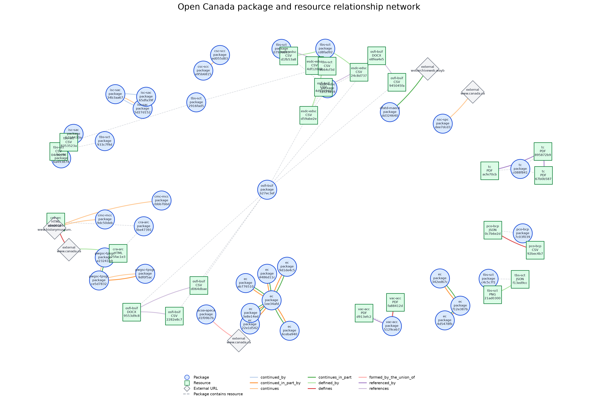

# Relationship Networks

<!-- RELATIONSHIP_NETWORK_REPORT_START -->
[](https://github.com/open-data/analytics-corporate-reporting/actions/workflows/data_rels_network_rpt.yml)


[](https://flatgithub.com/open-data/analytics-corporate-reporting?filename=DATA_RELS_NETWORK_RPT/relationship_network_stats.csv)



## Current Summary

- Last updated: `2026-07-17`
- Departments with relationships: `15`
- Source relationship edges: `51`
- Expanded relationship edges: `51`
- Rendered nodes across department charts: `65`
- Package nodes: `36`
- Resource nodes: `24`
- External URL nodes: `5`
- Cross-department resolved edges: `4`
- Department chart files changed on this run: `0`

## Largest Department Networks

| Department | Nodes | Source edges | Expanded edges | Connected departments |
|---|---:|---:|---:|---|
| ec | 10 | 16 | 16 | ec |
| tbs-sct | 9 | 3 | 3 | tbs-sct |
| osfi-bsif | 7 | 4 | 4 | osfi-bsif |
| esdc-edsc | 6 | 4 | 4 | esdc-edsc;tbs-sct |
| isc-sac | 5 | 7 | 7 | isc-sac |
| cra-arc | 4 | 2 | 2 | cra-arc |
| tc | 4 | 2 | 2 | tc |
| cmc-mcc | 3 | 2 | 2 | cmc-mcc |
| pco-bcp | 3 | 1 | 1 | pco-bcp |
| pwgsc-tpsgc | 3 | 4 | 4 | pwgsc-tpsgc |
<!-- RELATIONSHIP_NETWORK_REPORT_END -->

## REPORT INFO

This report scans the Open Canada metadata JSONL feed and builds one Mermaid
network chart for each department that has package-level or resource-level
relationships.

The generator writes:

| Path | Purpose |
|---|---|
| `DATA_RELS_NETWORK_RPT/charts/*.md` | One Mermaid chart per source department with relationships. |
| `DATA_RELS_NETWORK_RPT/relationship_network_stats.csv` | Daily department metrics sorted by `date` descending and `department` ascending. |

Run locally:

```bash
python3 DATA_RELS_NETWORK_RPT/relationship_network.py
```

Smoke test without touching repo outputs:

```bash
tmp_dir="$(mktemp -d)"
python3 DATA_RELS_NETWORK_RPT/relationship_network.py \
  --limit 100 \
  --chart-dir "$tmp_dir/charts" \
  --stats-csv "$tmp_dir/relationship_network_stats.csv"
rm -rf "$tmp_dir"
```

Chart files are only rewritten when the department network content changes. The
stats CSV replaces the current date and department row on rerun, then sorts by
date descending and department ascending.

Metrics collected:

| Column | Meaning |
|---|---|
| `source_relation_edges` | Outgoing relationship records originating from the department. |
| `expanded_relation_edges` | Relationship records included after adding directly connected nodes. |
| `package_relation_edges` | Source department relationship records from package-level metadata. |
| `resource_relation_edges` | Source department relationship records from resource-level metadata. |
| `total_nodes` | Package, resource, and URL nodes in the rendered chart. |
| `package_nodes` | Package nodes in the rendered chart. |
| `resource_nodes` | Resource nodes in the rendered chart. |
| `url_nodes` | External or unresolved URL nodes in the rendered chart. |
| `connected_departments_count` | Count of departments represented in resolved package/resource nodes. |
| `connected_departments` | Semicolon-separated resolved departments represented in the chart. |
| `internal_open_canada_edges` | Chart edges that resolve to Open Canada package/resource nodes. |
| `external_url_edges` | Chart edges that point to unresolved or external URLs. |
| `cross_department_edges` | Chart edges whose resolved source and target departments differ. |
| `relation_types` | JSON object of source relationship type counts. |
| `chart_changed` | `Y` if the chart file content changed on this run, otherwise `N`. |
