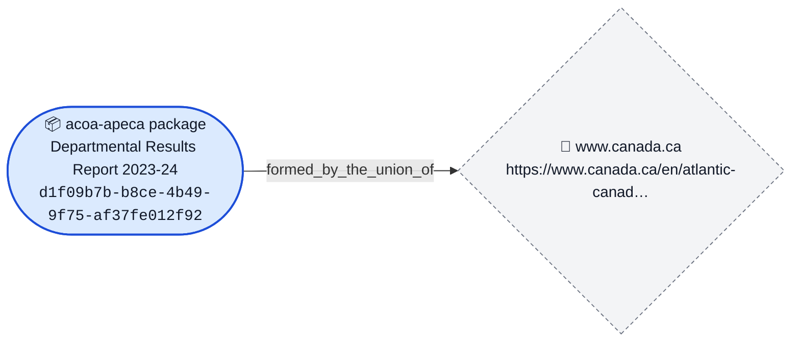

# acoa-apeca Relationship Network

```mermaid
flowchart LR
  N1(["📦 acoa-apeca package<br/>Departmental Results Report 2023-24<br/><code>d1f09b7b-b8ce-4b49-9f75-af37fe012f92</code>"])
  N2{"🔗 www.canada.ca<br/>https://www.canada.ca/en/atlantic-canad…"}
  N1 -- "formed_by_the_union_of" --> N2
  class N1 seed
  class N2 url
  classDef seed fill:#dbeafe,stroke:#1d4ed8,stroke-width:2px,color:#111827
  classDef other fill:#ecfccb,stroke:#4d7c0f,stroke-width:1px,color:#111827
  classDef url fill:#f3f4f6,stroke:#6b7280,stroke-dasharray: 4 3,color:#111827
```
