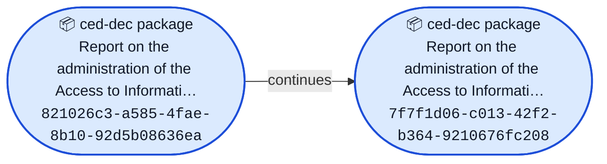

# ced-dec Relationship Network

```mermaid
flowchart LR
  N1(["📦 ced-dec package<br/>Report on the administration of the Access to Informati…<br/><code>7f7f1d06-c013-42f2-b364-9210676fc208</code>"])
  N2(["📦 ced-dec package<br/>Report on the administration of the Access to Informati…<br/><code>821026c3-a585-4fae-8b10-92d5b08636ea</code>"])
  N2 -- "continues" --> N1
  class N1 seed
  class N2 seed
  classDef seed fill:#dbeafe,stroke:#1d4ed8,stroke-width:2px,color:#111827
  classDef other fill:#ecfccb,stroke:#4d7c0f,stroke-width:1px,color:#111827
  classDef url fill:#f3f4f6,stroke:#6b7280,stroke-dasharray: 4 3,color:#111827
```
