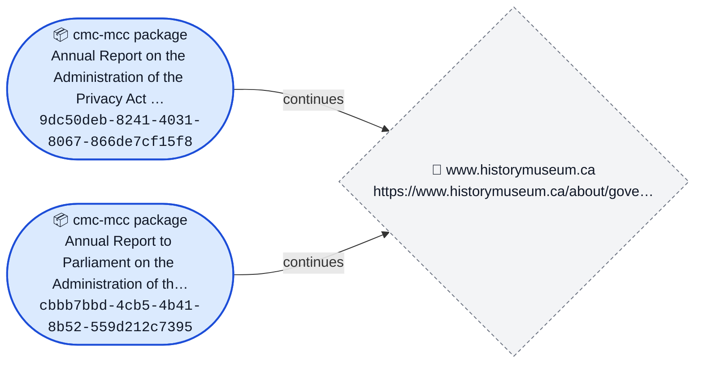

# cmc-mcc Relationship Network

```mermaid
flowchart LR
  N1(["📦 cmc-mcc package<br/>Annual Report on the Administration of the Privacy Act …<br/><code>9dc50deb-8241-4031-8067-866de7cf15f8</code>"])
  N2(["📦 cmc-mcc package<br/>Annual Report to Parliament on the Administration of th…<br/><code>cbbb7bbd-4cb5-4b41-8b52-559d212c7395</code>"])
  N3{"🔗 www.historymuseum.ca<br/>https://www.historymuseum.ca/about/gove…"}
  N1 -- "continues" --> N3
  N2 -- "continues" --> N3
  class N1 seed
  class N2 seed
  class N3 url
  classDef seed fill:#dbeafe,stroke:#1d4ed8,stroke-width:2px,color:#111827
  classDef other fill:#ecfccb,stroke:#4d7c0f,stroke-width:1px,color:#111827
  classDef url fill:#f3f4f6,stroke:#6b7280,stroke-dasharray: 4 3,color:#111827
```
