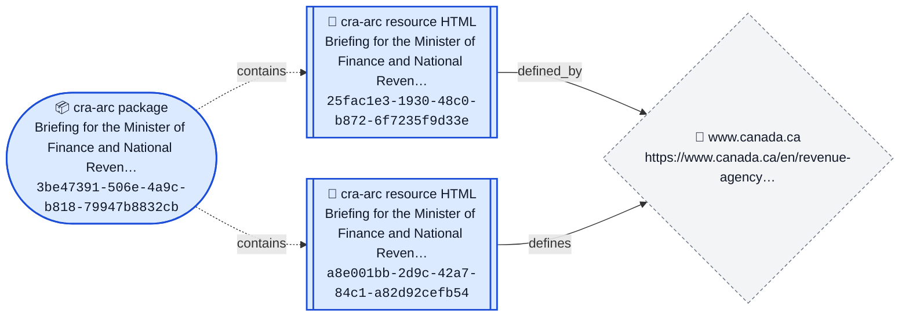

# cra-arc Relationship Network

```mermaid
flowchart LR
  N1(["📦 cra-arc package<br/>Briefing for the Minister of Finance and National Reven…<br/><code>3be47391-506e-4a9c-b818-79947b8832cb</code>"])
  N2[["📄 cra-arc resource HTML<br/>Briefing for the Minister of Finance and National Reven…<br/><code>25fac1e3-1930-48c0-b872-6f7235f9d33e</code>"]]
  N3[["📄 cra-arc resource HTML<br/>Briefing for the Minister of Finance and National Reven…<br/><code>a8e001bb-2d9c-42a7-84c1-a82d92cefb54</code>"]]
  N4{"🔗 www.canada.ca<br/>https://www.canada.ca/en/revenue-agency…"}
  N1 -. contains .-> N2
  N1 -. contains .-> N3
  N2 -- "defined_by" --> N4
  N3 -- "defines" --> N4
  class N1 seed
  class N2 seed
  class N3 seed
  class N4 url
  classDef seed fill:#dbeafe,stroke:#1d4ed8,stroke-width:2px,color:#111827
  classDef other fill:#ecfccb,stroke:#4d7c0f,stroke-width:1px,color:#111827
  classDef url fill:#f3f4f6,stroke:#6b7280,stroke-dasharray: 4 3,color:#111827
```
