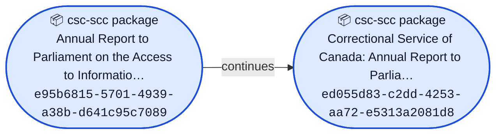

# csc-scc Relationship Network

```mermaid
flowchart LR
  N1(["📦 csc-scc package<br/>Annual Report to Parliament on the Access to Informatio…<br/><code>e95b6815-5701-4939-a38b-d641c95c7089</code>"])
  N2(["📦 csc-scc package<br/>Correctional Service of Canada: Annual Report to Parlia…<br/><code>ed055d83-c2dd-4253-aa72-e5313a2081d8</code>"])
  N1 -- "continues" --> N2
  class N1 seed
  class N2 seed
  classDef seed fill:#dbeafe,stroke:#1d4ed8,stroke-width:2px,color:#111827
  classDef other fill:#ecfccb,stroke:#4d7c0f,stroke-width:1px,color:#111827
  classDef url fill:#f3f4f6,stroke:#6b7280,stroke-dasharray: 4 3,color:#111827
```
