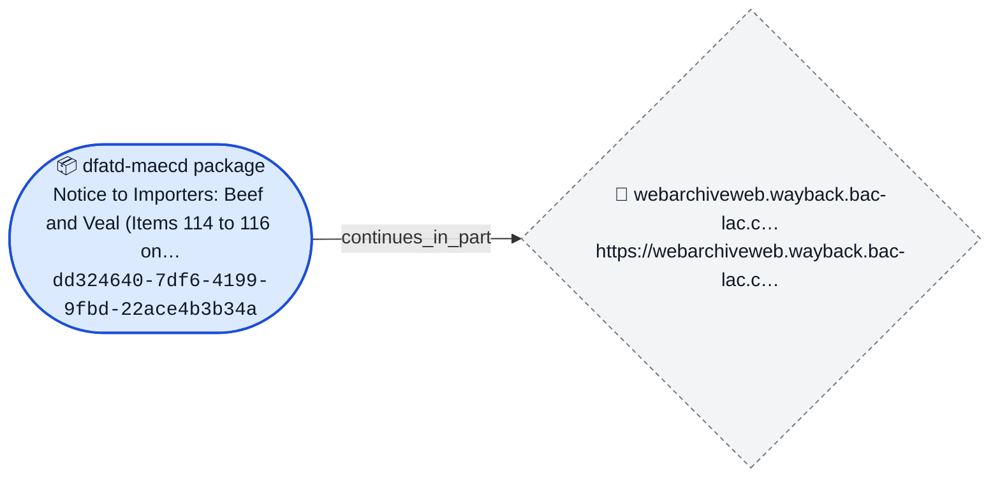

# dfatd-maecd Relationship Network

```mermaid
flowchart LR
  N1(["📦 dfatd-maecd package<br/>Notice to Importers: Beef and Veal (Items 114 to 116 on…<br/><code>dd324640-7df6-4199-9fbd-22ace4b3b34a</code>"])
  N2{"🔗 webarchiveweb.wayback.bac-lac.c…<br/>https://webarchiveweb.wayback.bac-lac.c…"}
  N1 -- "continues_in_part" --> N2
  class N1 seed
  class N2 url
  classDef seed fill:#dbeafe,stroke:#1d4ed8,stroke-width:2px,color:#111827
  classDef other fill:#ecfccb,stroke:#4d7c0f,stroke-width:1px,color:#111827
  classDef url fill:#f3f4f6,stroke:#6b7280,stroke-dasharray: 4 3,color:#111827
```
