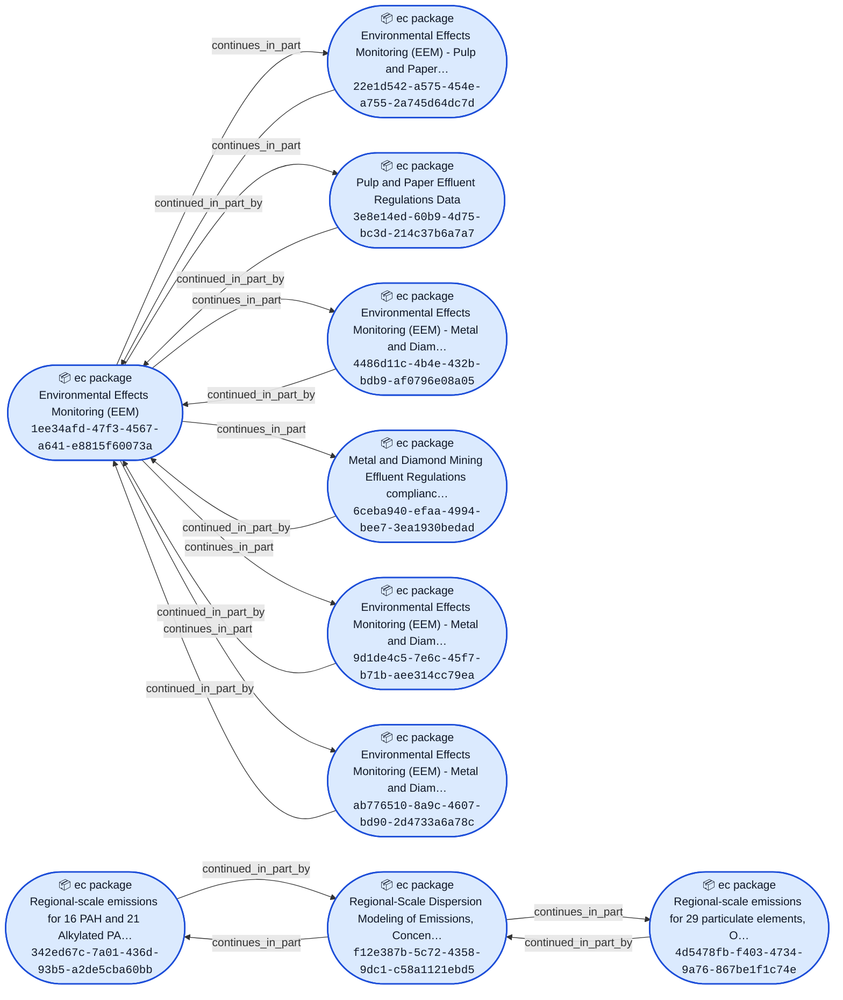

# ec Relationship Network

```mermaid
flowchart LR
  N1(["📦 ec package<br/>Environmental Effects Monitoring (EEM)<br/><code>1ee34afd-47f3-4567-a641-e8815f60073a</code>"])
  N2(["📦 ec package<br/>Environmental Effects Monitoring (EEM) - Pulp and Paper…<br/><code>22e1d542-a575-454e-a755-2a745d64dc7d</code>"])
  N3(["📦 ec package<br/>Regional-scale emissions for 16 PAH and 21 Alkylated PA…<br/><code>342ed67c-7a01-436d-93b5-a2de5cba60bb</code>"])
  N4(["📦 ec package<br/>Pulp and Paper Effluent Regulations Data<br/><code>3e8e14ed-60b9-4d75-bc3d-214c37b6a7a7</code>"])
  N5(["📦 ec package<br/>Environmental Effects Monitoring (EEM) - Metal and Diam…<br/><code>4486d11c-4b4e-432b-bdb9-af0796e08a05</code>"])
  N6(["📦 ec package<br/>Regional-scale emissions for 29 particulate elements, O…<br/><code>4d5478fb-f403-4734-9a76-867be1f1c74e</code>"])
  N7(["📦 ec package<br/>Metal and Diamond Mining Effluent Regulations complianc…<br/><code>6ceba940-efaa-4994-bee7-3ea1930bedad</code>"])
  N8(["📦 ec package<br/>Environmental Effects Monitoring (EEM) - Metal and Diam…<br/><code>9d1de4c5-7e6c-45f7-b71b-aee314cc79ea</code>"])
  N9(["📦 ec package<br/>Environmental Effects Monitoring (EEM) - Metal and Diam…<br/><code>ab776510-8a9c-4607-bd90-2d4733a6a78c</code>"])
  N10(["📦 ec package<br/>Regional-Scale Dispersion Modeling of Emissions, Concen…<br/><code>f12e387b-5c72-4358-9dc1-c58a1121ebd5</code>"])
  N1 -- "continues_in_part" --> N2
  N1 -- "continues_in_part" --> N4
  N1 -- "continues_in_part" --> N5
  N1 -- "continues_in_part" --> N7
  N1 -- "continues_in_part" --> N8
  N1 -- "continues_in_part" --> N9
  N2 -- "continued_in_part_by" --> N1
  N3 -- "continued_in_part_by" --> N10
  N4 -- "continued_in_part_by" --> N1
  N5 -- "continued_in_part_by" --> N1
  N6 -- "continued_in_part_by" --> N10
  N7 -- "continued_in_part_by" --> N1
  N8 -- "continued_in_part_by" --> N1
  N9 -- "continued_in_part_by" --> N1
  N10 -- "continues_in_part" --> N3
  N10 -- "continues_in_part" --> N6
  class N1 seed
  class N2 seed
  class N3 seed
  class N4 seed
  class N5 seed
  class N6 seed
  class N7 seed
  class N8 seed
  class N9 seed
  class N10 seed
  classDef seed fill:#dbeafe,stroke:#1d4ed8,stroke-width:2px,color:#111827
  classDef other fill:#ecfccb,stroke:#4d7c0f,stroke-width:1px,color:#111827
  classDef url fill:#f3f4f6,stroke:#6b7280,stroke-dasharray: 4 3,color:#111827
```
