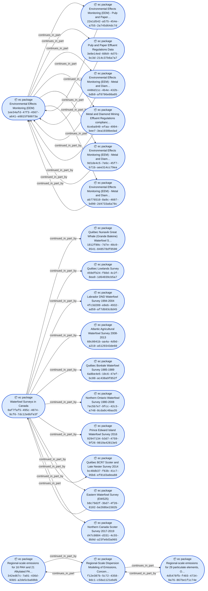

# ec Relationship Network

```mermaid
flowchart LR
  N1(["📦 ec package<br/>Waterfowl Surveys in Canada<br/><code>0af7faf5-495c-4074-9cf6-7dc12e6bfe3f</code>"])
  N2(["📦 ec package<br/>Québec Nunavik Great Whale (Grande Baleine) Waterfowl S…<br/><code>1812f80c-7d7e-48c0-8541-848578df0590</code>"])
  N3(["📦 ec package<br/>Environmental Effects Monitoring (EEM)<br/><code>1ee34afd-47f3-4567-a641-e8815f60073a</code>"])
  N4(["📦 ec package<br/>Environmental Effects Monitoring (EEM) - Pulp and Paper…<br/><code>22e1d542-a575-454e-a755-2a745d64dc7d</code>"])
  N5(["📦 ec package<br/>Regional-scale emissions for 16 PAH and 21 Alkylated PA…<br/><code>342ed67c-7a01-436d-93b5-a2de5cba60bb</code>"])
  N6(["📦 ec package<br/>Pulp and Paper Effluent Regulations Data<br/><code>3e8e14ed-60b9-4d75-bc3d-214c37b6a7a7</code>"])
  N7(["📦 ec package<br/>Environmental Effects Monitoring (EEM) - Metal and Diam…<br/><code>4486d11c-4b4e-432b-bdb9-af0796e08a05</code>"])
  N8(["📦 ec package<br/>Québec Lowlands Survey<br/><code>459dfb24-f60d-4c2f-8ea9-1d64039cb5a7</code>"])
  N9(["📦 ec package<br/>Regional-scale emissions for 29 particulate elements, O…<br/><code>4d5478fb-f403-4734-9a76-867be1f1c74e</code>"])
  N10(["📦 ec package<br/>Labrador DND Waterfowl Survey 1994-2004<br/><code>4fc3d289-e8eb-4932-ad59-af7db93c8d45</code>"])
  N11(["📦 ec package<br/>Atlantic Agricultural Waterfowl Survey 2008-2013<br/><code>60c0041b-aa4a-4d9d-a219-a5129343de60</code>"])
  N12(["📦 ec package<br/>Québec Boréale Waterfowl Survey 1985-1989<br/><code>6a8be4e5-10c6-47ef-bc00-ac438a9f852f</code>"])
  N13(["📦 ec package<br/>Metal and Diamond Mining Effluent Regulations complianc…<br/><code>6ceba940-efaa-4994-bee7-3ea1930bedad</code>"])
  N14(["📦 ec package<br/>Northern Ontario Waterfowl Survey 1980-2008<br/><code>7ec5b7e7-9fcc-42c3-a748-8cda0c40aa35</code>"])
  N15(["📦 ec package<br/>Prince Edward Island Waterfowl Survey 2016<br/><code>92947134-b3d7-4759-9f26-9819a42813e5</code>"])
  N16(["📦 ec package<br/>Environmental Effects Monitoring (EEM) - Metal and Diam…<br/><code>9d1de4c5-7e6c-45f7-b71b-aee314cc79ea</code>"])
  N17(["📦 ec package<br/>Environmental Effects Monitoring (EEM) - Metal and Diam…<br/><code>ab776510-8a9c-4607-bd90-2d4733a6a78c</code>"])
  N18(["📦 ec package<br/>Eastern Waterfowl Survey (EWS25)<br/><code>b8c79d2f-3bd7-4f26-8102-be268be1582b</code>"])
  N19(["📦 ec package<br/>Québec BCR7 Scoter and Late Nester Survey 2014<br/><code>bc48db37-f63b-41c7-95b6-ef81d3a0ea88</code>"])
  N20(["📦 ec package<br/>Northern Canada Scoter Survey 2017-2019<br/><code>d47c0884-d331-4c55-8b9d-a23fe0d3a965</code>"])
  N21(["📦 ec package<br/>Regional-Scale Dispersion Modeling of Emissions, Concen…<br/><code>f12e387b-5c72-4358-9dc1-c58a1121ebd5</code>"])
  N1 -- "continued_in_part_by" --> N2
  N1 -- "continued_in_part_by" --> N8
  N1 -- "continued_in_part_by" --> N10
  N1 -- "continued_in_part_by" --> N11
  N1 -- "continued_in_part_by" --> N12
  N1 -- "continued_in_part_by" --> N14
  N1 -- "continued_in_part_by" --> N15
  N1 -- "continued_in_part_by" --> N18
  N1 -- "continued_in_part_by" --> N19
  N1 -- "continued_in_part_by" --> N20
  N3 -- "continues_in_part" --> N4
  N3 -- "continues_in_part" --> N6
  N3 -- "continues_in_part" --> N7
  N3 -- "continues_in_part" --> N13
  N3 -- "continues_in_part" --> N16
  N3 -- "continues_in_part" --> N17
  N4 -- "continued_in_part_by" --> N3
  N5 -- "continued_in_part_by" --> N21
  N6 -- "continued_in_part_by" --> N3
  N7 -- "continued_in_part_by" --> N3
  N9 -- "continued_in_part_by" --> N21
  N13 -- "continued_in_part_by" --> N3
  N16 -- "continued_in_part_by" --> N3
  N17 -- "continued_in_part_by" --> N3
  N18 -- "continues_in_part" --> N1
  N21 -- "continues_in_part" --> N5
  N21 -- "continues_in_part" --> N9
  class N1 seed
  class N2 seed
  class N3 seed
  class N4 seed
  class N5 seed
  class N6 seed
  class N7 seed
  class N8 seed
  class N9 seed
  class N10 seed
  class N11 seed
  class N12 seed
  class N13 seed
  class N14 seed
  class N15 seed
  class N16 seed
  class N17 seed
  class N18 seed
  class N19 seed
  class N20 seed
  class N21 seed
  classDef seed fill:#dbeafe,stroke:#1d4ed8,stroke-width:2px,color:#111827
  classDef other fill:#ecfccb,stroke:#4d7c0f,stroke-width:1px,color:#111827
  classDef url fill:#f3f4f6,stroke:#6b7280,stroke-dasharray: 4 3,color:#111827
```
