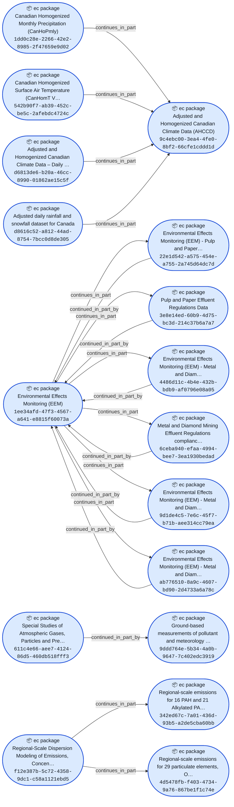

# ec Relationship Network

```mermaid
flowchart LR
  N1(["📦 ec package<br/>Canadian Homogenized Monthly Precipitation (CanHoPmly)<br/><code>1dd0c28e-2266-42e2-8985-2f47659e9d02</code>"])
  N2(["📦 ec package<br/>Environmental Effects Monitoring (EEM)<br/><code>1ee34afd-47f3-4567-a641-e8815f60073a</code>"])
  N3(["📦 ec package<br/>Environmental Effects Monitoring (EEM) - Pulp and Paper…<br/><code>22e1d542-a575-454e-a755-2a745d64dc7d</code>"])
  N4(["📦 ec package<br/>Regional-scale emissions for 16 PAH and 21 Alkylated PA…<br/><code>342ed67c-7a01-436d-93b5-a2de5cba60bb</code>"])
  N5(["📦 ec package<br/>Pulp and Paper Effluent Regulations Data<br/><code>3e8e14ed-60b9-4d75-bc3d-214c37b6a7a7</code>"])
  N6(["📦 ec package<br/>Environmental Effects Monitoring (EEM) - Metal and Diam…<br/><code>4486d11c-4b4e-432b-bdb9-af0796e08a05</code>"])
  N7(["📦 ec package<br/>Regional-scale emissions for 29 particulate elements, O…<br/><code>4d5478fb-f403-4734-9a76-867be1f1c74e</code>"])
  N8(["📦 ec package<br/>Canadian Homogenized Surface Air Temperature (CanHomT V…<br/><code>542b90f7-ab39-452c-be5c-2afebdc4724c</code>"])
  N9(["📦 ec package<br/>Special Studies of Atmospheric Gases, Particles and Pre…<br/><code>611c4e66-aee7-4124-86d5-460db518fff3</code>"])
  N10(["📦 ec package<br/>Metal and Diamond Mining Effluent Regulations complianc…<br/><code>6ceba940-efaa-4994-bee7-3ea1930bedad</code>"])
  N11(["📦 ec package<br/>Adjusted and Homogenized Canadian Climate Data (AHCCD)<br/><code>9c4ebc00-3ea4-4fe0-8bf2-66cfe1cddd1d</code>"])
  N12(["📦 ec package<br/>Environmental Effects Monitoring (EEM) - Metal and Diam…<br/><code>9d1de4c5-7e6c-45f7-b71b-aee314cc79ea</code>"])
  N13(["📦 ec package<br/>Ground-based measurements of pollutant and meteorology …<br/><code>9ddd764e-5b34-4a0b-9647-7c402edc3919</code>"])
  N14(["📦 ec package<br/>Environmental Effects Monitoring (EEM) - Metal and Diam…<br/><code>ab776510-8a9c-4607-bd90-2d4733a6a78c</code>"])
  N15(["📦 ec package<br/>Adjusted and Homogenized Canadian Climate Data – Daily …<br/><code>d6813de6-b20a-46cc-8990-01862ae15c5f</code>"])
  N16(["📦 ec package<br/>Adjusted daily rainfall and snowfall dataset for Canada<br/><code>d8616c52-a812-44ad-8754-7bcc0d8de305</code>"])
  N17(["📦 ec package<br/>Regional-Scale Dispersion Modeling of Emissions, Concen…<br/><code>f12e387b-5c72-4358-9dc1-c58a1121ebd5</code>"])
  N1 -- "continues_in_part" --> N11
  N2 -- "continues_in_part" --> N3
  N2 -- "continues_in_part" --> N5
  N2 -- "continues_in_part" --> N6
  N2 -- "continues_in_part" --> N10
  N2 -- "continues_in_part" --> N12
  N2 -- "continues_in_part" --> N14
  N3 -- "continued_in_part_by" --> N2
  N5 -- "continued_in_part_by" --> N2
  N6 -- "continued_in_part_by" --> N2
  N8 -- "continues_in_part" --> N11
  N9 -- "continued_in_part_by" --> N13
  N10 -- "continued_in_part_by" --> N2
  N12 -- "continued_in_part_by" --> N2
  N14 -- "continued_in_part_by" --> N2
  N15 -- "continues_in_part" --> N11
  N16 -- "continues_in_part" --> N11
  N17 -- "continues_in_part" --> N4
  N17 -- "continues_in_part" --> N7
  class N1 seed
  class N2 seed
  class N3 seed
  class N4 seed
  class N5 seed
  class N6 seed
  class N7 seed
  class N8 seed
  class N9 seed
  class N10 seed
  class N11 seed
  class N12 seed
  class N13 seed
  class N14 seed
  class N15 seed
  class N16 seed
  class N17 seed
  classDef seed fill:#dbeafe,stroke:#1d4ed8,stroke-width:2px,color:#111827
  classDef other fill:#ecfccb,stroke:#4d7c0f,stroke-width:1px,color:#111827
  classDef url fill:#f3f4f6,stroke:#6b7280,stroke-dasharray: 4 3,color:#111827
```
