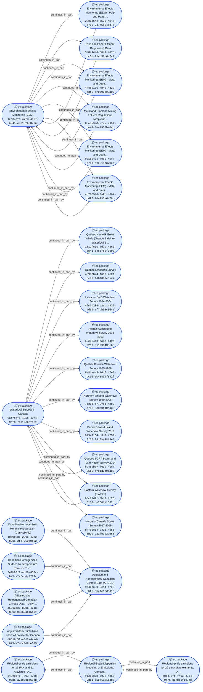

# ec Relationship Network

```mermaid
flowchart LR
  N1(["📦 ec package<br/>Waterfowl Surveys in Canada<br/><code>0af7faf5-495c-4074-9cf6-7dc12e6bfe3f</code>"])
  N2(["📦 ec package<br/>Québec Nunavik Great Whale (Grande Baleine) Waterfowl S…<br/><code>1812f80c-7d7e-48c0-8541-848578df0590</code>"])
  N3(["📦 ec package<br/>Canadian Homogenized Monthly Precipitation (CanHoPmly)<br/><code>1dd0c28e-2266-42e2-8985-2f47659e9d02</code>"])
  N4(["📦 ec package<br/>Environmental Effects Monitoring (EEM)<br/><code>1ee34afd-47f3-4567-a641-e8815f60073a</code>"])
  N5(["📦 ec package<br/>Environmental Effects Monitoring (EEM) - Pulp and Paper…<br/><code>22e1d542-a575-454e-a755-2a745d64dc7d</code>"])
  N6(["📦 ec package<br/>Regional-scale emissions for 16 PAH and 21 Alkylated PA…<br/><code>342ed67c-7a01-436d-93b5-a2de5cba60bb</code>"])
  N7(["📦 ec package<br/>Pulp and Paper Effluent Regulations Data<br/><code>3e8e14ed-60b9-4d75-bc3d-214c37b6a7a7</code>"])
  N8(["📦 ec package<br/>Environmental Effects Monitoring (EEM) - Metal and Diam…<br/><code>4486d11c-4b4e-432b-bdb9-af0796e08a05</code>"])
  N9(["📦 ec package<br/>Québec Lowlands Survey<br/><code>459dfb24-f60d-4c2f-8ea9-1d64039cb5a7</code>"])
  N10(["📦 ec package<br/>Regional-scale emissions for 29 particulate elements, O…<br/><code>4d5478fb-f403-4734-9a76-867be1f1c74e</code>"])
  N11(["📦 ec package<br/>Labrador DND Waterfowl Survey 1994-2004<br/><code>4fc3d289-e8eb-4932-ad59-af7db93c8d45</code>"])
  N12(["📦 ec package<br/>Canadian Homogenized Surface Air Temperature (CanHomT V…<br/><code>542b90f7-ab39-452c-be5c-2afebdc4724c</code>"])
  N13(["📦 ec package<br/>Atlantic Agricultural Waterfowl Survey 2008-2013<br/><code>60c0041b-aa4a-4d9d-a219-a5129343de60</code>"])
  N14(["📦 ec package<br/>Québec Boréale Waterfowl Survey 1985-1989<br/><code>6a8be4e5-10c6-47ef-bc00-ac438a9f852f</code>"])
  N15(["📦 ec package<br/>Metal and Diamond Mining Effluent Regulations complianc…<br/><code>6ceba940-efaa-4994-bee7-3ea1930bedad</code>"])
  N16(["📦 ec package<br/>Northern Ontario Waterfowl Survey 1980-2008<br/><code>7ec5b7e7-9fcc-42c3-a748-8cda0c40aa35</code>"])
  N17(["📦 ec package<br/>Prince Edward Island Waterfowl Survey 2016<br/><code>92947134-b3d7-4759-9f26-9819a42813e5</code>"])
  N18(["📦 ec package<br/>Adjusted and Homogenized Canadian Climate Data (AHCCD)<br/><code>9c4ebc00-3ea4-4fe0-8bf2-66cfe1cddd1d</code>"])
  N19(["📦 ec package<br/>Environmental Effects Monitoring (EEM) - Metal and Diam…<br/><code>9d1de4c5-7e6c-45f7-b71b-aee314cc79ea</code>"])
  N20(["📦 ec package<br/>Environmental Effects Monitoring (EEM) - Metal and Diam…<br/><code>ab776510-8a9c-4607-bd90-2d4733a6a78c</code>"])
  N21(["📦 ec package<br/>Eastern Waterfowl Survey (EWS25)<br/><code>b8c79d2f-3bd7-4f26-8102-be268be1582b</code>"])
  N22(["📦 ec package<br/>Québec BCR7 Scoter and Late Nester Survey 2014<br/><code>bc48db37-f63b-41c7-95b6-ef81d3a0ea88</code>"])
  N23(["📦 ec package<br/>Northern Canada Scoter Survey 2017-2019<br/><code>d47c0884-d331-4c55-8b9d-a23fe0d3a965</code>"])
  N24(["📦 ec package<br/>Adjusted and Homogenized Canadian Climate Data – Daily …<br/><code>d6813de6-b20a-46cc-8990-01862ae15c5f</code>"])
  N25(["📦 ec package<br/>Adjusted daily rainfall and snowfall dataset for Canada<br/><code>d8616c52-a812-44ad-8754-7bcc0d8de305</code>"])
  N26(["📦 ec package<br/>Regional-Scale Dispersion Modeling of Emissions, Concen…<br/><code>f12e387b-5c72-4358-9dc1-c58a1121ebd5</code>"])
  N1 -- "continued_in_part_by" --> N2
  N1 -- "continued_in_part_by" --> N9
  N1 -- "continued_in_part_by" --> N11
  N1 -- "continued_in_part_by" --> N13
  N1 -- "continued_in_part_by" --> N14
  N1 -- "continued_in_part_by" --> N16
  N1 -- "continued_in_part_by" --> N17
  N1 -- "continued_in_part_by" --> N21
  N1 -- "continued_in_part_by" --> N22
  N1 -- "continued_in_part_by" --> N23
  N3 -- "continues_in_part" --> N18
  N4 -- "continues_in_part" --> N5
  N4 -- "continues_in_part" --> N7
  N4 -- "continues_in_part" --> N8
  N4 -- "continues_in_part" --> N15
  N4 -- "continues_in_part" --> N19
  N4 -- "continues_in_part" --> N20
  N5 -- "continued_in_part_by" --> N4
  N6 -- "continued_in_part_by" --> N26
  N7 -- "continued_in_part_by" --> N4
  N8 -- "continued_in_part_by" --> N4
  N10 -- "continued_in_part_by" --> N26
  N12 -- "continues_in_part" --> N18
  N15 -- "continued_in_part_by" --> N4
  N19 -- "continued_in_part_by" --> N4
  N20 -- "continued_in_part_by" --> N4
  N21 -- "continues_in_part" --> N1
  N24 -- "continues_in_part" --> N18
  N25 -- "continues_in_part" --> N18
  N26 -- "continues_in_part" --> N6
  N26 -- "continues_in_part" --> N10
  class N1 seed
  class N2 seed
  class N3 seed
  class N4 seed
  class N5 seed
  class N6 seed
  class N7 seed
  class N8 seed
  class N9 seed
  class N10 seed
  class N11 seed
  class N12 seed
  class N13 seed
  class N14 seed
  class N15 seed
  class N16 seed
  class N17 seed
  class N18 seed
  class N19 seed
  class N20 seed
  class N21 seed
  class N22 seed
  class N23 seed
  class N24 seed
  class N25 seed
  class N26 seed
  classDef seed fill:#dbeafe,stroke:#1d4ed8,stroke-width:2px,color:#111827
  classDef other fill:#ecfccb,stroke:#4d7c0f,stroke-width:1px,color:#111827
  classDef url fill:#f3f4f6,stroke:#6b7280,stroke-dasharray: 4 3,color:#111827
```
