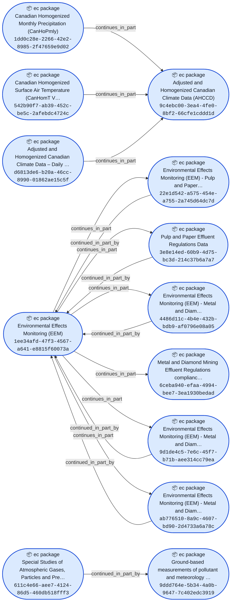

# ec Relationship Network

```mermaid
flowchart LR
  N1(["📦 ec package<br/>Canadian Homogenized Monthly Precipitation (CanHoPmly)<br/><code>1dd0c28e-2266-42e2-8985-2f47659e9d02</code>"])
  N2(["📦 ec package<br/>Environmental Effects Monitoring (EEM)<br/><code>1ee34afd-47f3-4567-a641-e8815f60073a</code>"])
  N3(["📦 ec package<br/>Environmental Effects Monitoring (EEM) - Pulp and Paper…<br/><code>22e1d542-a575-454e-a755-2a745d64dc7d</code>"])
  N4(["📦 ec package<br/>Pulp and Paper Effluent Regulations Data<br/><code>3e8e14ed-60b9-4d75-bc3d-214c37b6a7a7</code>"])
  N5(["📦 ec package<br/>Environmental Effects Monitoring (EEM) - Metal and Diam…<br/><code>4486d11c-4b4e-432b-bdb9-af0796e08a05</code>"])
  N6(["📦 ec package<br/>Canadian Homogenized Surface Air Temperature (CanHomT V…<br/><code>542b90f7-ab39-452c-be5c-2afebdc4724c</code>"])
  N7(["📦 ec package<br/>Special Studies of Atmospheric Gases, Particles and Pre…<br/><code>611c4e66-aee7-4124-86d5-460db518fff3</code>"])
  N8(["📦 ec package<br/>Metal and Diamond Mining Effluent Regulations complianc…<br/><code>6ceba940-efaa-4994-bee7-3ea1930bedad</code>"])
  N9(["📦 ec package<br/>Adjusted and Homogenized Canadian Climate Data (AHCCD)<br/><code>9c4ebc00-3ea4-4fe0-8bf2-66cfe1cddd1d</code>"])
  N10(["📦 ec package<br/>Environmental Effects Monitoring (EEM) - Metal and Diam…<br/><code>9d1de4c5-7e6c-45f7-b71b-aee314cc79ea</code>"])
  N11(["📦 ec package<br/>Ground-based measurements of pollutant and meteorology …<br/><code>9ddd764e-5b34-4a0b-9647-7c402edc3919</code>"])
  N12(["📦 ec package<br/>Environmental Effects Monitoring (EEM) - Metal and Diam…<br/><code>ab776510-8a9c-4607-bd90-2d4733a6a78c</code>"])
  N13(["📦 ec package<br/>Adjusted and Homogenized Canadian Climate Data – Daily …<br/><code>d6813de6-b20a-46cc-8990-01862ae15c5f</code>"])
  N1 -- "continues_in_part" --> N9
  N2 -- "continues_in_part" --> N3
  N2 -- "continues_in_part" --> N4
  N2 -- "continues_in_part" --> N5
  N2 -- "continues_in_part" --> N8
  N2 -- "continues_in_part" --> N10
  N2 -- "continues_in_part" --> N12
  N3 -- "continued_in_part_by" --> N2
  N4 -- "continued_in_part_by" --> N2
  N5 -- "continued_in_part_by" --> N2
  N6 -- "continues_in_part" --> N9
  N7 -- "continued_in_part_by" --> N11
  N10 -- "continued_in_part_by" --> N2
  N12 -- "continued_in_part_by" --> N2
  N13 -- "continues_in_part" --> N9
  class N1 seed
  class N2 seed
  class N3 seed
  class N4 seed
  class N5 seed
  class N6 seed
  class N7 seed
  class N8 seed
  class N9 seed
  class N10 seed
  class N11 seed
  class N12 seed
  class N13 seed
  classDef seed fill:#dbeafe,stroke:#1d4ed8,stroke-width:2px,color:#111827
  classDef other fill:#ecfccb,stroke:#4d7c0f,stroke-width:1px,color:#111827
  classDef url fill:#f3f4f6,stroke:#6b7280,stroke-dasharray: 4 3,color:#111827
```
