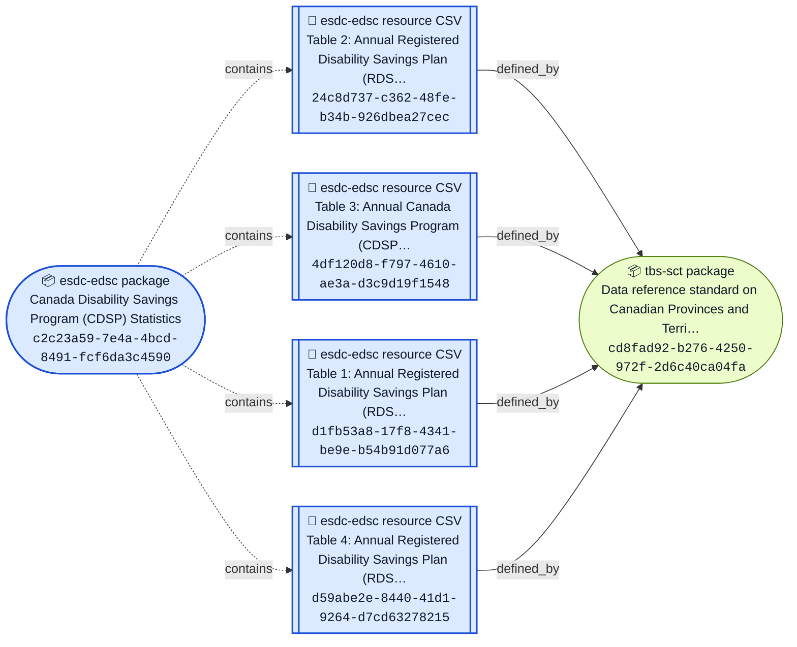

# esdc-edsc Relationship Network

```mermaid
flowchart LR
  N1(["📦 esdc-edsc package<br/>Canada Disability Savings Program (CDSP) Statistics<br/><code>c2c23a59-7e4a-4bcd-8491-fcf6da3c4590</code>"])
  N2(["📦 tbs-sct package<br/>Data reference standard on Canadian Provinces and Terri…<br/><code>cd8fad92-b276-4250-972f-2d6c40ca04fa</code>"])
  N3[["📄 esdc-edsc resource CSV<br/>Table 2: Annual Registered Disability Savings Plan (RDS…<br/><code>24c8d737-c362-48fe-b34b-926dbea27cec</code>"]]
  N4[["📄 esdc-edsc resource CSV<br/>Table 3: Annual Canada Disability Savings Program (CDSP…<br/><code>4df120d8-f797-4610-ae3a-d3c9d19f1548</code>"]]
  N5[["📄 esdc-edsc resource CSV<br/>Table 1: Annual Registered Disability Savings Plan (RDS…<br/><code>d1fb53a8-17f8-4341-be9e-b54b91d077a6</code>"]]
  N6[["📄 esdc-edsc resource CSV<br/>Table 4: Annual Registered Disability Savings Plan (RDS…<br/><code>d59abe2e-8440-41d1-9264-d7cd63278215</code>"]]
  N1 -. contains .-> N3
  N1 -. contains .-> N4
  N1 -. contains .-> N5
  N1 -. contains .-> N6
  N3 -- "defined_by" --> N2
  N4 -- "defined_by" --> N2
  N5 -- "defined_by" --> N2
  N6 -- "defined_by" --> N2
  class N1 seed
  class N2 other
  class N3 seed
  class N4 seed
  class N5 seed
  class N6 seed
  classDef seed fill:#dbeafe,stroke:#1d4ed8,stroke-width:2px,color:#111827
  classDef other fill:#ecfccb,stroke:#4d7c0f,stroke-width:1px,color:#111827
  classDef url fill:#f3f4f6,stroke:#6b7280,stroke-dasharray: 4 3,color:#111827
```
