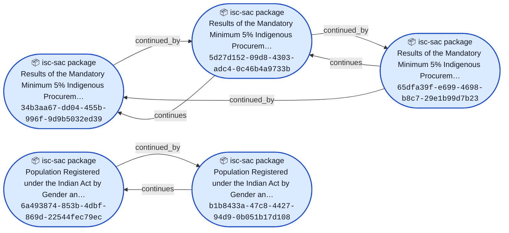

# isc-sac Relationship Network

```mermaid
flowchart LR
  N1(["📦 isc-sac package<br/>Results of the Mandatory Minimum 5% Indigenous Procurem…<br/><code>34b3aa67-dd04-455b-996f-9d9b5032ed39</code>"])
  N2(["📦 isc-sac package<br/>Results of the Mandatory Minimum 5% Indigenous Procurem…<br/><code>5d27d152-09d8-4303-adc4-0c46b4a9733b</code>"])
  N3(["📦 isc-sac package<br/>Results of the Mandatory Minimum 5% Indigenous Procurem…<br/><code>65dfa39f-e699-4698-b8c7-29e1b99d7b23</code>"])
  N4(["📦 isc-sac package<br/>Population Registered under the Indian Act by Gender an…<br/><code>6a493874-853b-4dbf-869d-22544fec79ec</code>"])
  N5(["📦 isc-sac package<br/>Population Registered under the Indian Act by Gender an…<br/><code>b1b8433a-47c8-4427-94d9-0b051b17d108</code>"])
  N1 -- "continued_by" --> N2
  N2 -- "continued_by" --> N3
  N2 -- "continues" --> N1
  N3 -- "continued_by" --> N1
  N3 -- "continues" --> N2
  N4 -- "continued_by" --> N5
  N5 -- "continues" --> N4
  class N1 seed
  class N2 seed
  class N3 seed
  class N4 seed
  class N5 seed
  classDef seed fill:#dbeafe,stroke:#1d4ed8,stroke-width:2px,color:#111827
  classDef other fill:#ecfccb,stroke:#4d7c0f,stroke-width:1px,color:#111827
  classDef url fill:#f3f4f6,stroke:#6b7280,stroke-dasharray: 4 3,color:#111827
```
