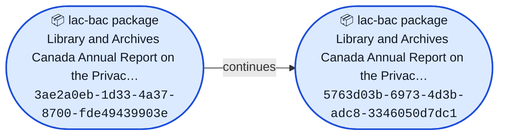

# lac-bac Relationship Network

```mermaid
flowchart LR
  N1(["📦 lac-bac package<br/>Library and Archives Canada Annual Report on the Privac…<br/><code>3ae2a0eb-1d33-4a37-8700-fde49439903e</code>"])
  N2(["📦 lac-bac package<br/>Library and Archives Canada Annual Report on the Privac…<br/><code>5763d03b-6973-4d3b-adc8-3346050d7dc1</code>"])
  N1 -- "continues" --> N2
  class N1 seed
  class N2 seed
  classDef seed fill:#dbeafe,stroke:#1d4ed8,stroke-width:2px,color:#111827
  classDef other fill:#ecfccb,stroke:#4d7c0f,stroke-width:1px,color:#111827
  classDef url fill:#f3f4f6,stroke:#6b7280,stroke-dasharray: 4 3,color:#111827
```
