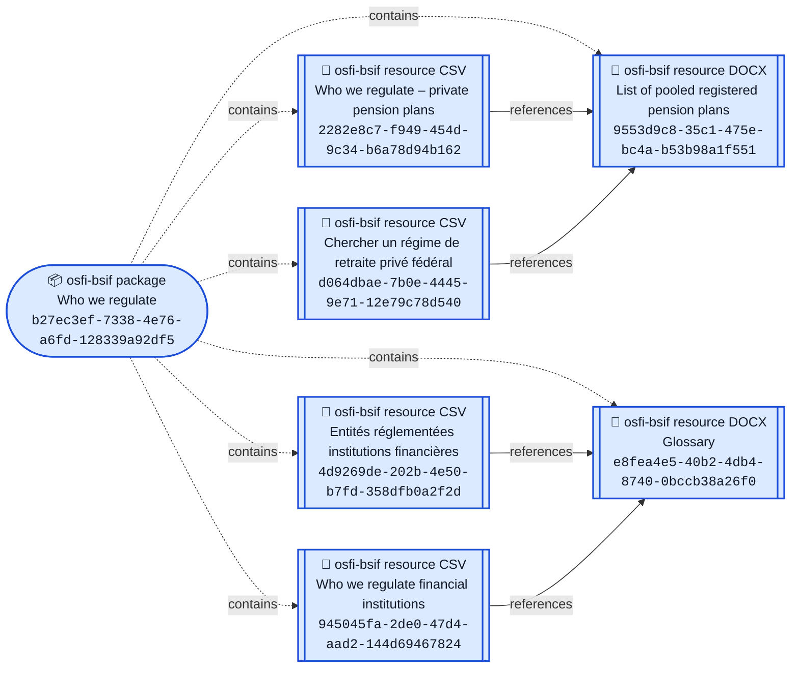

# osfi-bsif Relationship Network

```mermaid
flowchart LR
  N1(["📦 osfi-bsif package<br/>Who we regulate<br/><code>b27ec3ef-7338-4e76-a6fd-128339a92df5</code>"])
  N2[["📄 osfi-bsif resource CSV<br/>Who we regulate – private pension plans<br/><code>2282e8c7-f949-454d-9c34-b6a78d94b162</code>"]]
  N3[["📄 osfi-bsif resource CSV<br/>Entités réglementées institutions financières<br/><code>4d9269de-202b-4e50-b7fd-358dfb0a2f2d</code>"]]
  N4[["📄 osfi-bsif resource CSV<br/>Who we regulate financial institutions<br/><code>945045fa-2de0-47d4-aad2-144d69467824</code>"]]
  N5[["📄 osfi-bsif resource DOCX<br/>List of pooled registered pension plans<br/><code>9553d9c8-35c1-475e-bc4a-b53b98a1f551</code>"]]
  N6[["📄 osfi-bsif resource CSV<br/>Chercher un régime de retraite privé fédéral<br/><code>d064dbae-7b0e-4445-9e71-12e79c78d540</code>"]]
  N7[["📄 osfi-bsif resource DOCX<br/>Glossary<br/><code>e8fea4e5-40b2-4db4-8740-0bccb38a26f0</code>"]]
  N1 -. contains .-> N2
  N1 -. contains .-> N3
  N1 -. contains .-> N4
  N1 -. contains .-> N5
  N1 -. contains .-> N6
  N1 -. contains .-> N7
  N2 -- "references" --> N5
  N3 -- "references" --> N7
  N4 -- "references" --> N7
  N6 -- "references" --> N5
  class N1 seed
  class N2 seed
  class N3 seed
  class N4 seed
  class N5 seed
  class N6 seed
  class N7 seed
  classDef seed fill:#dbeafe,stroke:#1d4ed8,stroke-width:2px,color:#111827
  classDef other fill:#ecfccb,stroke:#4d7c0f,stroke-width:1px,color:#111827
  classDef url fill:#f3f4f6,stroke:#6b7280,stroke-dasharray: 4 3,color:#111827
```
