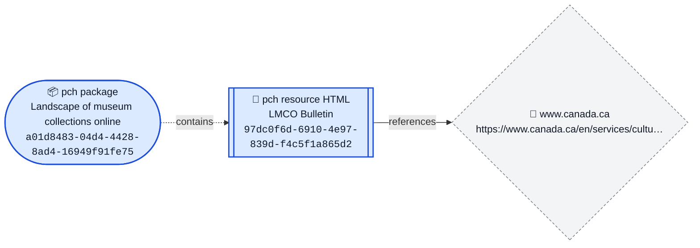

# pch Relationship Network

```mermaid
flowchart LR
  N1(["📦 pch package<br/>Landscape of museum collections online<br/><code>a01d8483-04d4-4428-8ad4-16949f91fe75</code>"])
  N2[["📄 pch resource HTML<br/>LMCO Bulletin<br/><code>97dc0f6d-6910-4e97-839d-f4c5f1a865d2</code>"]]
  N3{"🔗 www.canada.ca<br/>https://www.canada.ca/en/services/cultu…"}
  N1 -. contains .-> N2
  N2 -- "references" --> N3
  class N1 seed
  class N2 seed
  class N3 url
  classDef seed fill:#dbeafe,stroke:#1d4ed8,stroke-width:2px,color:#111827
  classDef other fill:#ecfccb,stroke:#4d7c0f,stroke-width:1px,color:#111827
  classDef url fill:#f3f4f6,stroke:#6b7280,stroke-dasharray: 4 3,color:#111827
```
