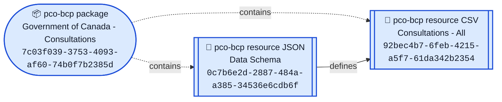

# pco-bcp Relationship Network

```mermaid
flowchart LR
  N1(["📦 pco-bcp package<br/>Government of Canada - Consultations<br/><code>7c03f039-3753-4093-af60-74b0f7b2385d</code>"])
  N2[["📄 pco-bcp resource JSON<br/>Data Schema<br/><code>0c7b6e2d-2887-484a-a385-34536e6cdb6f</code>"]]
  N3[["📄 pco-bcp resource CSV<br/>Consultations - All<br/><code>92bec4b7-6feb-4215-a5f7-61da342b2354</code>"]]
  N1 -. contains .-> N2
  N1 -. contains .-> N3
  N2 -- "defines" --> N3
  class N1 seed
  class N2 seed
  class N3 seed
  classDef seed fill:#dbeafe,stroke:#1d4ed8,stroke-width:2px,color:#111827
  classDef other fill:#ecfccb,stroke:#4d7c0f,stroke-width:1px,color:#111827
  classDef url fill:#f3f4f6,stroke:#6b7280,stroke-dasharray: 4 3,color:#111827
```
