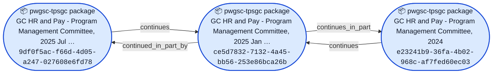

# pwgsc-tpsgc Relationship Network

```mermaid
flowchart LR
  N1(["📦 pwgsc-tpsgc package<br/>GC HR and Pay - Program Management Committee, 2025 Jul …<br/><code>9df0f5ac-f66d-4d05-a247-027608e6fd78</code>"])
  N2(["📦 pwgsc-tpsgc package<br/>GC HR and Pay - Program Management Committee, 2025 Jan …<br/><code>ce5d7832-7132-4a45-bb56-253e86bca26b</code>"])
  N3(["📦 pwgsc-tpsgc package<br/>GC HR and Pay - Program Management Committee, 2024<br/><code>e23241b9-36fa-4b02-968c-af7fed60ec03</code>"])
  N1 -- "continues" --> N2
  N2 -- "continued_in_part_by" --> N1
  N2 -- "continues_in_part" --> N3
  N3 -- "continues" --> N2
  class N1 seed
  class N2 seed
  class N3 seed
  classDef seed fill:#dbeafe,stroke:#1d4ed8,stroke-width:2px,color:#111827
  classDef other fill:#ecfccb,stroke:#4d7c0f,stroke-width:1px,color:#111827
  classDef url fill:#f3f4f6,stroke:#6b7280,stroke-dasharray: 4 3,color:#111827
```
