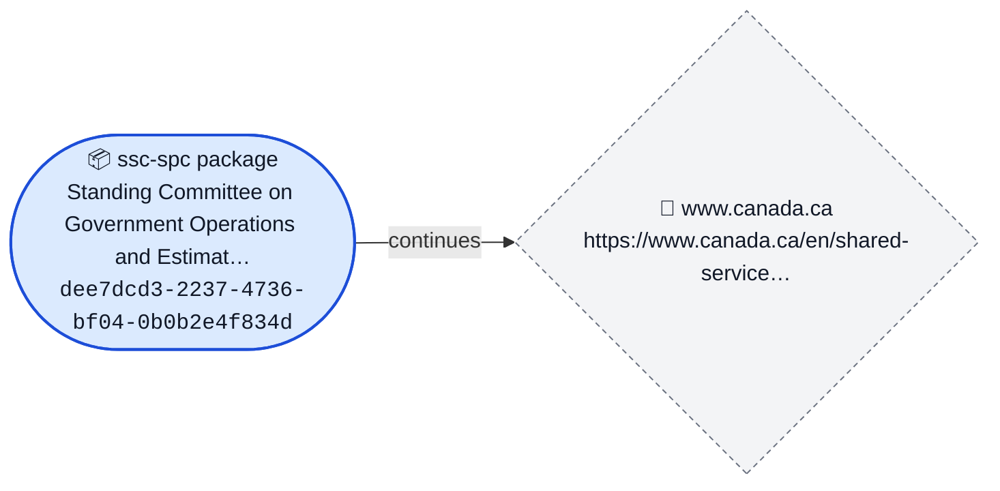

# ssc-spc Relationship Network

```mermaid
flowchart LR
  N1(["📦 ssc-spc package<br/>Standing Committee on Government Operations and Estimat…<br/><code>dee7dcd3-2237-4736-bf04-0b0b2e4f834d</code>"])
  N2{"🔗 www.canada.ca<br/>https://www.canada.ca/en/shared-service…"}
  N1 -- "continues" --> N2
  class N1 seed
  class N2 url
  classDef seed fill:#dbeafe,stroke:#1d4ed8,stroke-width:2px,color:#111827
  classDef other fill:#ecfccb,stroke:#4d7c0f,stroke-width:1px,color:#111827
  classDef url fill:#f3f4f6,stroke:#6b7280,stroke-dasharray: 4 3,color:#111827
```
