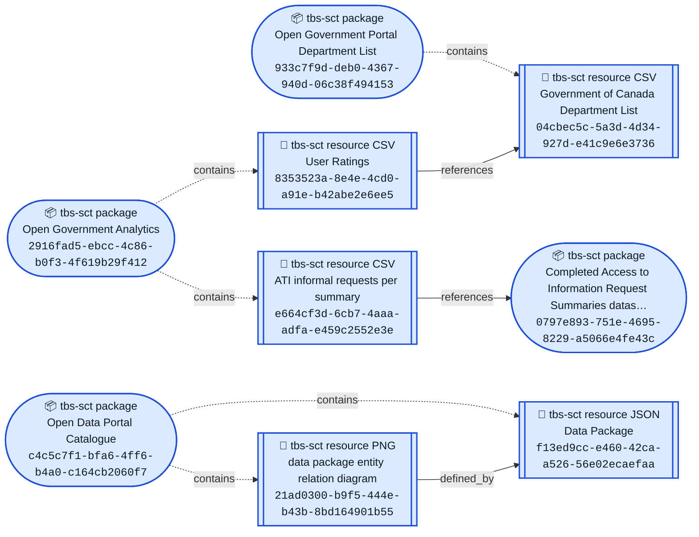

# tbs-sct Relationship Network

```mermaid
flowchart LR
  N1(["📦 tbs-sct package<br/>Completed Access to Information Request Summaries datas…<br/><code>0797e893-751e-4695-8229-a5066e4fe43c</code>"])
  N2(["📦 tbs-sct package<br/>Open Government Analytics<br/><code>2916fad5-ebcc-4c86-b0f3-4f619b29f412</code>"])
  N3(["📦 tbs-sct package<br/>Open Government Portal Department List<br/><code>933c7f9d-deb0-4367-940d-06c38f494153</code>"])
  N4(["📦 tbs-sct package<br/>Open Data Portal Catalogue<br/><code>c4c5c7f1-bfa6-4ff6-b4a0-c164cb2060f7</code>"])
  N5[["📄 tbs-sct resource CSV<br/>Government of Canada Department List<br/><code>04cbec5c-5a3d-4d34-927d-e41c9e6e3736</code>"]]
  N6[["📄 tbs-sct resource PNG<br/>data package entity relation diagram<br/><code>21ad0300-b9f5-444e-b43b-8bd164901b55</code>"]]
  N7[["📄 tbs-sct resource CSV<br/>User Ratings<br/><code>8353523a-8e4e-4cd0-a91e-b42abe2e6ee5</code>"]]
  N8[["📄 tbs-sct resource CSV<br/>ATI informal requests per summary<br/><code>e664cf3d-6cb7-4aaa-adfa-e459c2552e3e</code>"]]
  N9[["📄 tbs-sct resource JSON<br/>Data Package<br/><code>f13ed9cc-e460-42ca-a526-56e02ecaefaa</code>"]]
  N3 -. contains .-> N5
  N4 -. contains .-> N6
  N2 -. contains .-> N7
  N2 -. contains .-> N8
  N4 -. contains .-> N9
  N6 -- "defined_by" --> N9
  N7 -- "references" --> N5
  N8 -- "references" --> N1
  class N1 seed
  class N2 seed
  class N3 seed
  class N4 seed
  class N5 seed
  class N6 seed
  class N7 seed
  class N8 seed
  class N9 seed
  classDef seed fill:#dbeafe,stroke:#1d4ed8,stroke-width:2px,color:#111827
  classDef other fill:#ecfccb,stroke:#4d7c0f,stroke-width:1px,color:#111827
  classDef url fill:#f3f4f6,stroke:#6b7280,stroke-dasharray: 4 3,color:#111827
```
