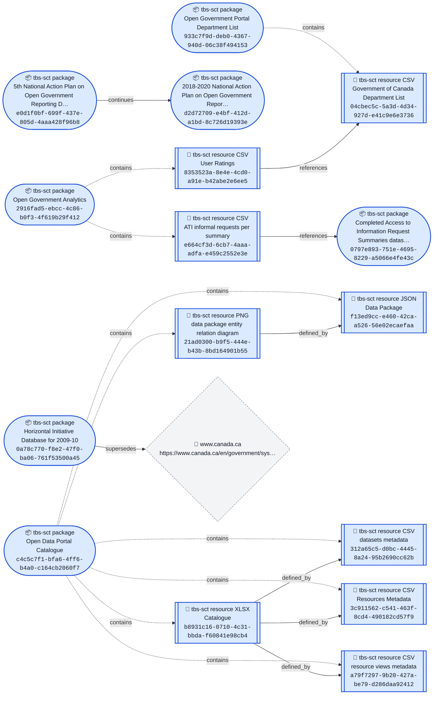

# tbs-sct Relationship Network

```mermaid
flowchart LR
  N1(["📦 tbs-sct package<br/>Completed Access to Information Request Summaries datas…<br/><code>0797e893-751e-4695-8229-a5066e4fe43c</code>"])
  N2(["📦 tbs-sct package<br/>Horizontal Initiative Database for 2009-10<br/><code>0a78c770-f8e2-47f0-ba06-761f53500a45</code>"])
  N3(["📦 tbs-sct package<br/>Open Government Analytics<br/><code>2916fad5-ebcc-4c86-b0f3-4f619b29f412</code>"])
  N4(["📦 tbs-sct package<br/>Open Government Portal Department List<br/><code>933c7f9d-deb0-4367-940d-06c38f494153</code>"])
  N5(["📦 tbs-sct package<br/>Open Data Portal Catalogue<br/><code>c4c5c7f1-bfa6-4ff6-b4a0-c164cb2060f7</code>"])
  N6(["📦 tbs-sct package<br/>2018-2020 National Action Plan on Open Government Repor…<br/><code>d2d72709-e4bf-412d-a1bd-8c726d19393e</code>"])
  N7(["📦 tbs-sct package<br/>5th National Action Plan on Open Government Reporting D…<br/><code>e0d1f0bf-699f-437e-805d-4aaa428f96b8</code>"])
  N8[["📄 tbs-sct resource CSV<br/>Government of Canada Department List<br/><code>04cbec5c-5a3d-4d34-927d-e41c9e6e3736</code>"]]
  N9[["📄 tbs-sct resource PNG<br/>data package entity relation diagram<br/><code>21ad0300-b9f5-444e-b43b-8bd164901b55</code>"]]
  N10[["📄 tbs-sct resource CSV<br/>datasets metadata<br/><code>312a65c5-d0bc-4445-8a24-95b2690cc62b</code>"]]
  N11[["📄 tbs-sct resource CSV<br/>Resources Metadata<br/><code>3c911562-c541-463f-8cd4-490182cd57f9</code>"]]
  N12[["📄 tbs-sct resource CSV<br/>User Ratings<br/><code>8353523a-8e4e-4cd0-a91e-b42abe2e6ee5</code>"]]
  N13[["📄 tbs-sct resource CSV<br/>resource views metadata<br/><code>a79f7297-9b20-427a-be79-d286daa92412</code>"]]
  N14[["📄 tbs-sct resource XLSX<br/>Catalogue<br/><code>b8931c16-0710-4c31-bbda-f60841e98cb4</code>"]]
  N15[["📄 tbs-sct resource CSV<br/>ATI informal requests per summary<br/><code>e664cf3d-6cb7-4aaa-adfa-e459c2552e3e</code>"]]
  N16[["📄 tbs-sct resource JSON<br/>Data Package<br/><code>f13ed9cc-e460-42ca-a526-56e02ecaefaa</code>"]]
  N17{"🔗 www.canada.ca<br/>https://www.canada.ca/en/government/sys…"}
  N4 -. contains .-> N8
  N5 -. contains .-> N9
  N5 -. contains .-> N10
  N5 -. contains .-> N11
  N3 -. contains .-> N12
  N5 -. contains .-> N13
  N5 -. contains .-> N14
  N3 -. contains .-> N15
  N5 -. contains .-> N16
  N2 -- "supersedes" --> N17
  N7 -- "continues" --> N6
  N9 -- "defined_by" --> N16
  N12 -- "references" --> N8
  N14 -- "defined_by" --> N10
  N14 -- "defined_by" --> N11
  N14 -- "defined_by" --> N13
  N15 -- "references" --> N1
  class N1 seed
  class N2 seed
  class N3 seed
  class N4 seed
  class N5 seed
  class N6 seed
  class N7 seed
  class N8 seed
  class N9 seed
  class N10 seed
  class N11 seed
  class N12 seed
  class N13 seed
  class N14 seed
  class N15 seed
  class N16 seed
  class N17 url
  classDef seed fill:#dbeafe,stroke:#1d4ed8,stroke-width:2px,color:#111827
  classDef other fill:#ecfccb,stroke:#4d7c0f,stroke-width:1px,color:#111827
  classDef url fill:#f3f4f6,stroke:#6b7280,stroke-dasharray: 4 3,color:#111827
```
