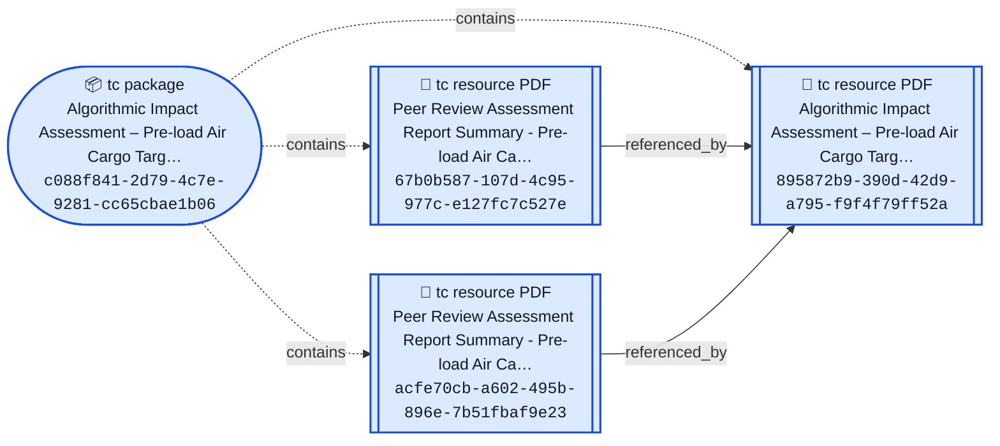

# tc Relationship Network

```mermaid
flowchart LR
  N1(["📦 tc package<br/>Algorithmic Impact Assessment – Pre-load Air Cargo Targ…<br/><code>c088f841-2d79-4c7e-9281-cc65cbae1b06</code>"])
  N2[["📄 tc resource PDF<br/>Peer Review Assessment Report Summary - Pre-load Air Ca…<br/><code>67b0b587-107d-4c95-977c-e127fc7c527e</code>"]]
  N3[["📄 tc resource PDF<br/>Algorithmic Impact Assessment – Pre-load Air Cargo Targ…<br/><code>895872b9-390d-42d9-a795-f9f4f79ff52a</code>"]]
  N4[["📄 tc resource PDF<br/>Peer Review Assessment Report Summary - Pre-load Air Ca…<br/><code>acfe70cb-a602-495b-896e-7b51fbaf9e23</code>"]]
  N1 -. contains .-> N2
  N1 -. contains .-> N3
  N1 -. contains .-> N4
  N2 -- "referenced_by" --> N3
  N4 -- "referenced_by" --> N3
  class N1 seed
  class N2 seed
  class N3 seed
  class N4 seed
  classDef seed fill:#dbeafe,stroke:#1d4ed8,stroke-width:2px,color:#111827
  classDef other fill:#ecfccb,stroke:#4d7c0f,stroke-width:1px,color:#111827
  classDef url fill:#f3f4f6,stroke:#6b7280,stroke-dasharray: 4 3,color:#111827
```
