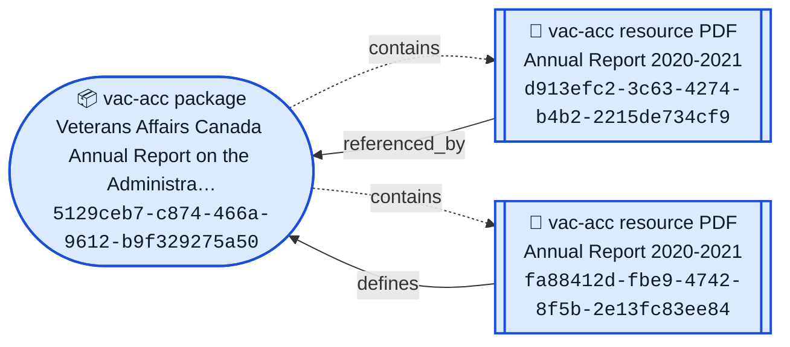

# vac-acc Relationship Network

```mermaid
flowchart LR
  N1(["📦 vac-acc package<br/>Veterans Affairs Canada Annual Report on the Administra…<br/><code>5129ceb7-c874-466a-9612-b9f329275a50</code>"])
  N2[["📄 vac-acc resource PDF<br/>Annual Report 2020-2021<br/><code>d913efc2-3c63-4274-b4b2-2215de734cf9</code>"]]
  N3[["📄 vac-acc resource PDF<br/>Annual Report 2020-2021<br/><code>fa88412d-fbe9-4742-8f5b-2e13fc83ee84</code>"]]
  N1 -. contains .-> N2
  N1 -. contains .-> N3
  N2 -- "referenced_by" --> N1
  N3 -- "defines" --> N1
  class N1 seed
  class N2 seed
  class N3 seed
  classDef seed fill:#dbeafe,stroke:#1d4ed8,stroke-width:2px,color:#111827
  classDef other fill:#ecfccb,stroke:#4d7c0f,stroke-width:1px,color:#111827
  classDef url fill:#f3f4f6,stroke:#6b7280,stroke-dasharray: 4 3,color:#111827
```
