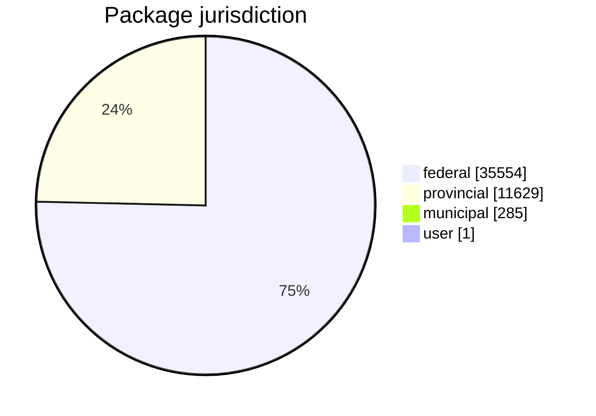
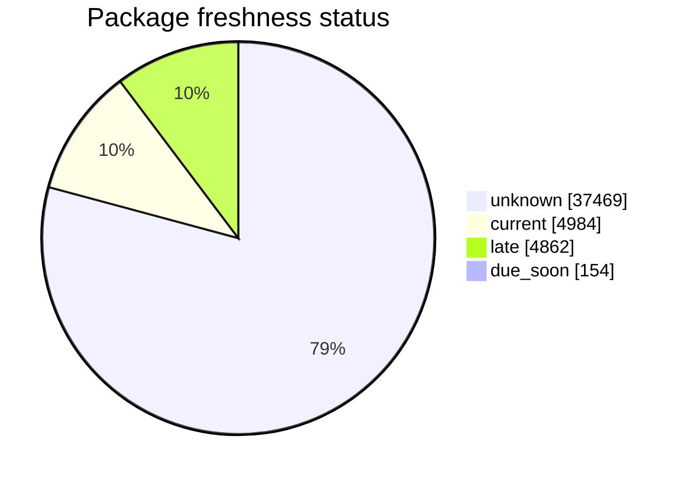
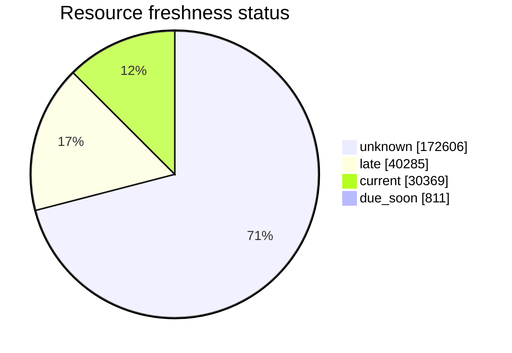
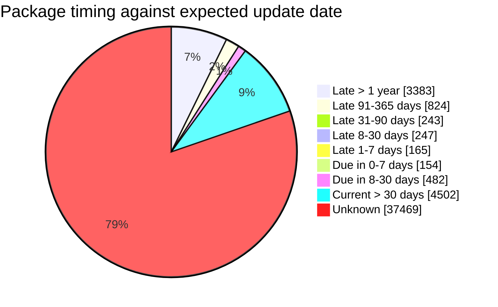
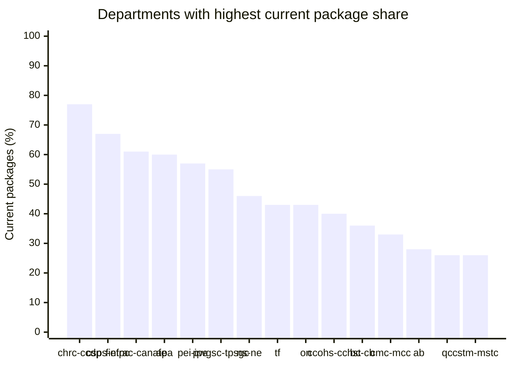

# FreshCheck

FreshCheck measures whether Open Canada packages and their resources appear current
against the package frequency metadata in the JSONL metadata feed.

The generator reads `https://open.canada.ca/static/od-do-canada.jsonl.gz`, builds
hierarchical package trees, and writes three JSON files grouped by package
`jurisdiction`:

| Output file | Jurisdiction values |
|---|---|
| `freshness_tree_federal.json` | `federal` |
| `freshness_tree_provincial.json` | `provincial` |
| `freshness_tree_municipal_user.json` | `municipal`, `user` |

Each package record contains the organization name, package id, metadata dates,
frequency, jurisdiction, and nested resource records. Each package and resource
also receives:

| Field | Meaning |
|---|---|
| `expected_update_date` | `metadata_modified` plus the package `frequency` interval. |
| `days_until_expected_update` | Positive values mean the item is not due yet; negative values mean it is late. |
| `freshness_status` | `current`, `due_soon`, `late`, or `unknown`. |

Frequency values are parsed as ISO 8601 date durations such as `P1D`, `P1W`,
`P1M`, `P3M`, `P6M`, and `P1Y`. Month and year frequencies use calendar-aware
month addition.

Run locally:

```bash
python3 FreshCheck/fresh_check.py
```

Smoke test without committing generated outputs:

```bash
python3 FreshCheck/fresh_check.py \
  --limit 25 \
  --output-dir FreshCheck/smoke_output \
  --readme FreshCheck/smoke_README.md
rm -rf FreshCheck/smoke_output FreshCheck/smoke_README.md
```

<!-- FRESHCHECK_REPORT_START -->
Generated at: `2026-07-01T04:52:44+00:00`
As of date: `2026-07-01`
Packages assessed: `47469`
Resources assessed: `244071`

### Split JSON Outputs
| File | Group | Jurisdiction values | Packages | Resources |
| --- | --- | --- | --- | --- |
| freshness_tree_federal.json | Federal | federal | 35554 | 164845 |
| freshness_tree_provincial.json | Provincial | provincial | 11629 | 77562 |
| freshness_tree_municipal_user.json | Municipal and user | municipal, user | 286 | 1664 |

### Package Jurisdictions


### Package Freshness Status


### Resource Freshness Status


### Package Update Timing


### Departments Keeping Data Current


### Skipped Jurisdictions
None.
<!-- FRESHCHECK_REPORT_END -->
