# JURISDICTION ANALYTICS REPORT

| File | Flat Viewer |
|--|--|
|**jurisdiction_dl.csv**  *Downloads*  | |
|**jurisdiction_visits.csv** Visits||
|**jurisdiction_mapviews.csv** Map Views||

## Downloads by Jurisdiction last 12 months

## Visits by Jurisdiction last 12 months

```mermaid

xychart-beta
    title "Visits by Jurisdiction 🟦Fed 🟩Prov 🟥Muni"
    x-axis [2024-10, 2024-11, 2024-12, 2025-1, 2025-2, 2025-3, 2025-4, 2025-5, 2025-6, 2025-7, 2025-8, 2025-9]
    y-axis "Visits" 0 --> 272226
    line [251571, 227132, 185011, 241301, 223582, 253230, 272216, 193535, 189640, 205069, 162264, 227254]
    line [67492, 58914, 50106, 69074, 64162, 77008, 81888, 63884, 63081, 63320, 53183, 78375]
    line [6644, 6054, 4970, 6014, 6299, 7117, 7807, 5126, 4800, 5300, 4431, 5841]
```

## Open Maps Views by Jurisdiction last 12 months

