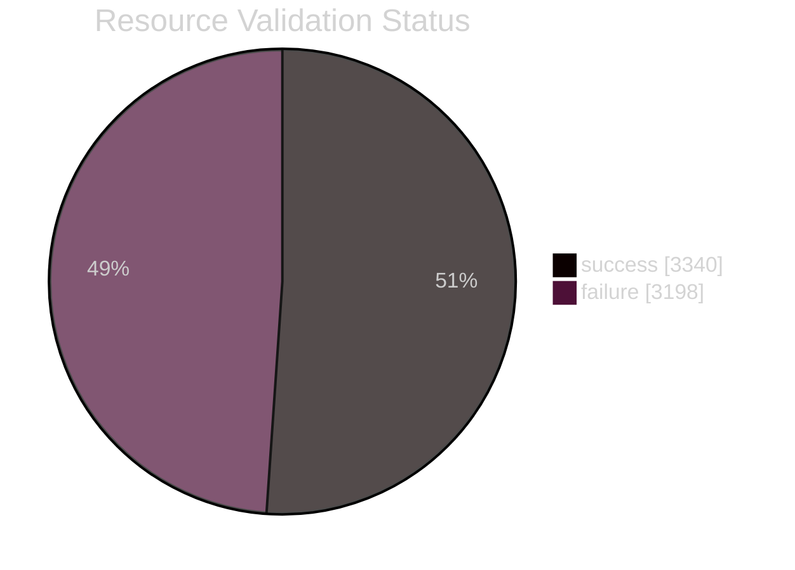
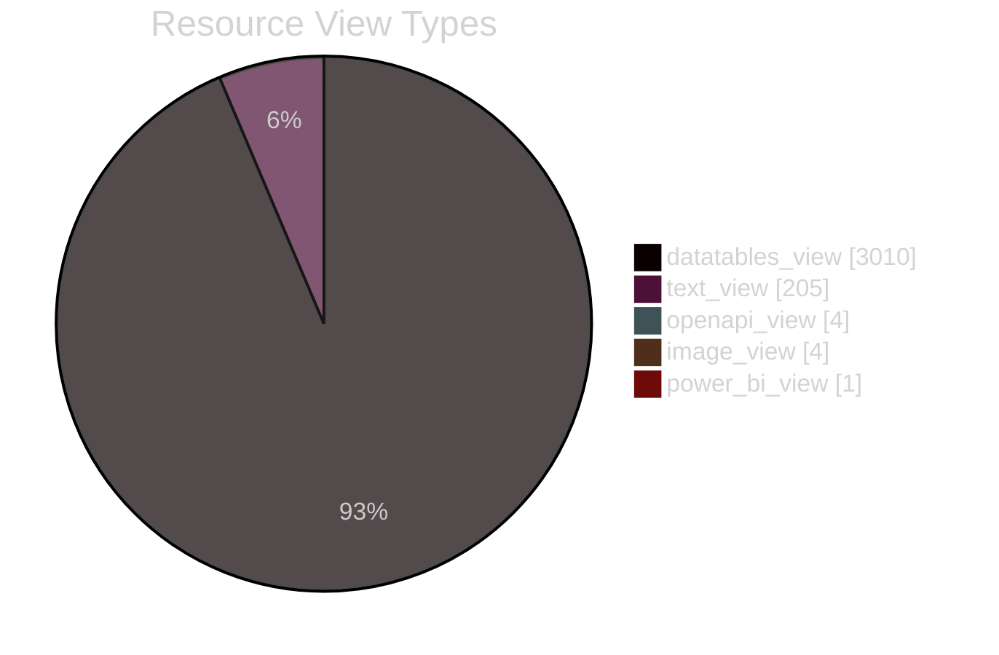
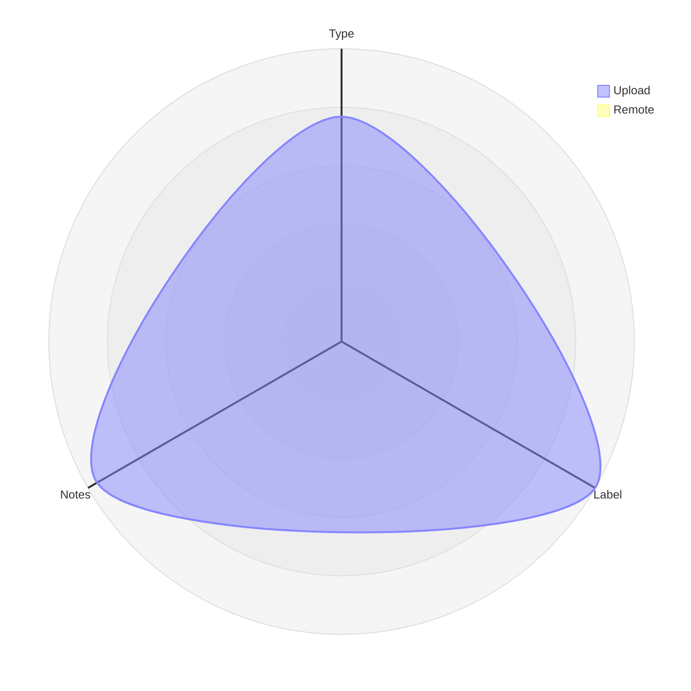
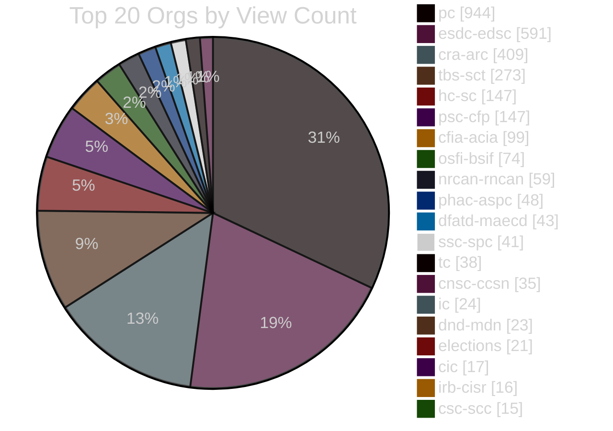
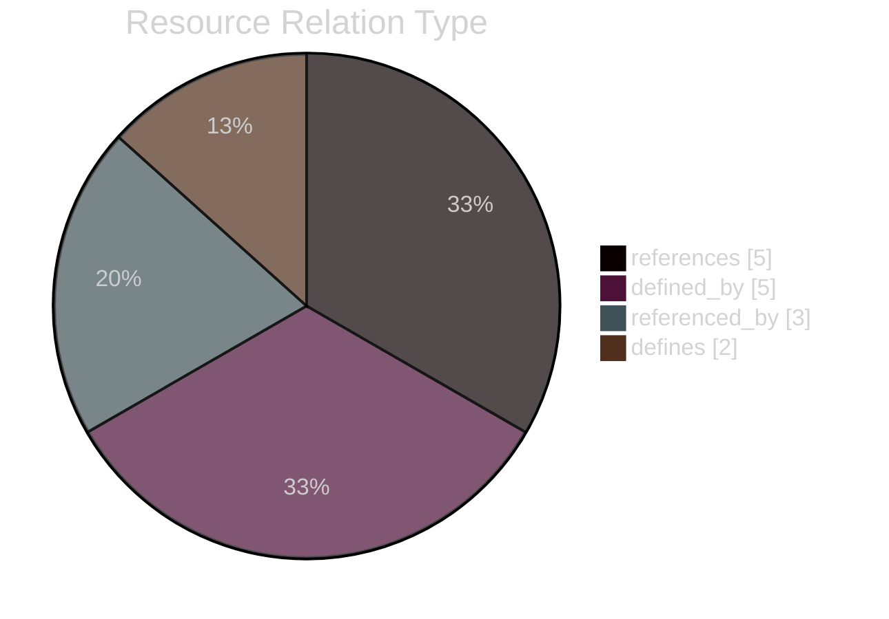

# Datastore Tracker Report
 
#### The Datastore Tracker Report captures stats on the Open.Canada.ca CKAN Datastore. 

| CSV | Description | Flatdata viewer |
|---|---|---|
| DS_num_tracker.csv | Daily datastore summary metrics (counts, sizes, uploaded/remote source). |  |
| org_stats.csv | Organization-level usage (size, counts). |  |
| ds-resources.csv | Resource list with datastore stats. |  |
| ds-dictionary-use.csv | Tracks if CKAN DS dictionary has been used. Count number of fields with data type, labels, and notes completed in each table  |  |
| res_views.csv | Captures list of resource views available |  |
| res_relations.csv | Resource relationship metadata. |  |
| res_validation_status.csv | Status of ckanext-validation checks on resources. |  |

#### Resource Validation Status
#### Resource Validation Status
<!-- VALIDATION_STATUS_CHART_START -->

<!-- VALIDATION_STATUS_CHART_END -->

#### Resource View Types
#### Resource View Types
<!-- RESOURCE_VIEW_TYPES_CHART_START -->

<!-- RESOURCE_VIEW_TYPES_CHART_END -->

#### Resource counts by URL host and org
#### Resource counts by URL host and org
<!-- RESOURCE_COUNTS_START -->
| url_host | owner | resource_count |
|---|---|---|
| od-do.agr.gc.ca | aafc-aac | 24 |
| open.canada.ca | aafc-aac | 3 |
| open.canada.ca | atssc-scdata | 4 |
| open.canada.ca | cbsa-asfc | 6 |
| open.canada.ca | cer-rec | 1 |
| open.canada.ca | cfia-acia | 85 |
| open.canada.ca | cic | 2 |
| open.canada.ca | cnsc-ccsn | 31 |
| open.canada.ca | cra-arc | 356 |
| open.canada.ca | csa-asc | 3 |
| open.canada.ca | csc-scc | 14 |
| open.canada.ca | csec-cstc | 14 |
| open.canada.ca | csps-efpc | 1 |
| open.canada.ca | dfatd-maecd | 43 |
| open.canada.ca | dfo-mpo | 2 |
| open.canada.ca | dnd-mdn | 22 |
| open.canada.ca | ec | 2 |
| open.canada.ca | elections | 23 |
| open.canada.ca | esdc-edsc | 544 |
| open.canada.ca | fin | 14 |
| open.canada.ca | hc-sc | 119 |
| open.canada.ca | iaac-aeic | 2 |
| open.canada.ca | ic | 23 |
| open.canada.ca | infc | 2 |
| open.canada.ca | irb-cisr | 16 |
| open.canada.ca | isc-sac | 10 |
| open.canada.ca | lac-bac | 8 |
| open.canada.ca | nrc-cnrc | 1 |
| open.canada.ca | nrcan-rncan | 53 |
| open.canada.ca | opc-cpvp | 9 |
| open.canada.ca | osfi-bsif | 74 |
| open.canada.ca | pc | 933 |
| open.canada.ca | pch | 7 |
| open.canada.ca | pco-bcp | 3 |
| open.canada.ca | phac-aspc | 39 |
| open.canada.ca | psc-cfp | 122 |
| open.canada.ca | pwgsc-tpsgc | 1 |
| open.canada.ca | rcmp-grc | 1 |
| open.canada.ca | ssc-spc | 39 |
| open.canada.ca | tbs-sct | 191 |
| open.canada.ca | tc | 39 |
| open.canada.ca | vac-acc | 12 |
| open.canada.ca | wd-deo | 10 |
| www.canada.ca | cra-arc | 58 |
| www.canada.ca | tbs-sct | 14 |
<!-- RESOURCE_COUNTS_END -->

#### Dictionary edit radar (by type)
#### Dictionary edit radar (by type)
<!-- DICT_RADAR_START -->

<!-- DICT_RADAR_END -->

#### Top 20 Orgs by View Count
#### Top 20 Orgs by View Count
<!-- TOP_20_OWNERS_CHART_START -->

<!-- TOP_20_OWNERS_CHART_END -->

#### Resource Relation Type
#### Resource Relation Type
<!-- RESOURCE_RELATION_TYPE_CHART_START -->

<!-- RESOURCE_RELATION_TYPE_CHART_END -->
